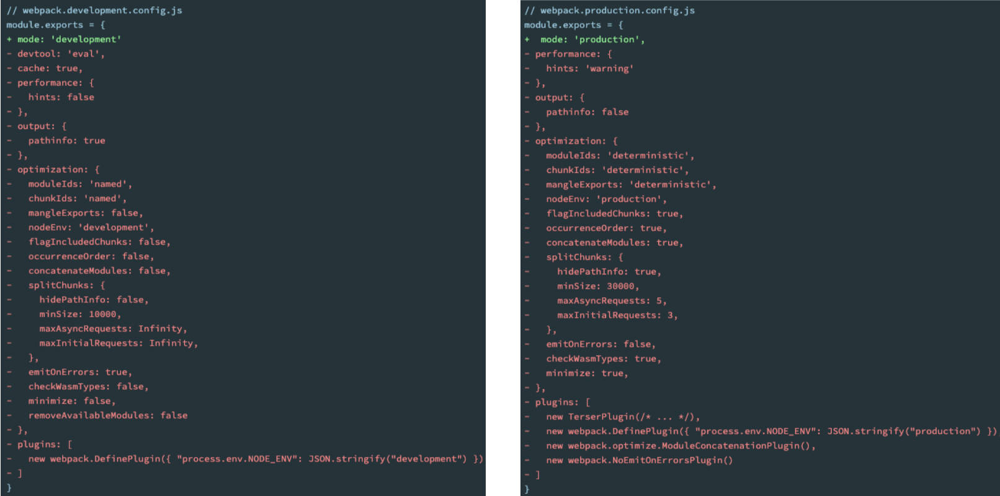

# 一、webpack 是什么？

官方的解释：“webpack is a static module bundler for modern JavaScript applications.”

webpack 是一个为现代 JavaScript 应用程序而生的静态模块化打包工具

以下是对关键词的解释：

- 打包 bundler：webpack 是一个打包工具；
- 静态的 static：webpack 将前端工程化项目，打包成静态资源（部署到静态服务器）；
- 模块化 module：webpack 默认支持各种模块化开发，比如：ES Module、CommonJS、AMD...；
- 现代的 modern：正是因为，现代前端开发，面临各种各样的问题，才催生了 webpack 的出现和发展；

回顾：前端项目开发模式，发展的三个阶段：

- 后端渲染；
  - jsp，asp
- 前后端分离
  - ajax + jQuery；本质上还是后端渲染。
- 前端渲染（现代的 JS 应用程序）
  - Vue / React 项目开发，对应脚手架分别是 Vue CLI / create-react-app，它们都基于 webpack 的。

# 二、webpack 打包基础

[回顾 webpack 打包基础的相关知识](https://github.com/Zt2tzzt/FRONT-END-ENGINEERING/blob/master/02-webpack%E5%9F%BA%E7%A1%80/01-Node%E5%86%85%E7%BD%AE%E6%A8%A1%E5%9D%97path-webpack%E5%9F%BA%E6%9C%AC%E4%BD%BF%E7%94%A8.md#%E4%BA%8Cwebpack-%E6%89%93%E5%8C%85%E5%9F%BA%E7%A1%80)

# 三、webpack 项目创建

创建 02-source-map 项目；

安装 _webpack_、_webpack-cli_

```shell
pnpm add webpack webpack-cli -D
```

编写 `src/main.js` 文件；

demo-project\02-source-map\src\main.js

```js
import { add, sub } from './utils/math'

const msg = 'Hello Frog'
console.log(msg)
console.log(address)

const foo = () => {
  console.log('foo function exec~')
}
foo()

console.log(add(20, 30))
console.log(sub(20, 30))
```

demo-project\02-source-map\src\utils\math.js

```js
function add(num1, num2) {
  return num1 + num2
}

function sub(num1, num2) {
  return num1 - num2
}

console.log(count)

export { add, sub }
```

编写 `webpack.config.js` 配置文件。

demo-project\02-source-map\webpack.config.js

```js
const path = require('path')

module.exports = {
  entry: './src/main.js',
  output: {
    path: path.resolve(__dirname, './build'),
    filename: 'boundle.js'
  }
}
```

执行命令。使用 webpack，根据配置文件，进行打包。

```shell
npx webpack
```

打包的效果（ 默认 `mode: 'production'`）

demo-project\02-source-map\build\boundle.js

```js
;(() => {
  'use strict'
  console.log(count),
    console.log('Hello Frog'),
    console.log(address),
    console.log('foo function exec~'),
    console.log(50),
    console.log(-10)
})()
```

# 四、Mode 配置

`mode` 配置选项：用于告知 webpack 使用响应模式的内置优化：

- `production`：默认值，准备打包上线的时候设置，打包的文件会被压缩和丑化。
- `development`：一般在开发阶段设置。
- `none`：不使用任何默认优化选项（只有 `entry`，`output` 两个配置，其它都不加）。

| 选项          | 描述                                                                                                                                                                                                                                         |
| :------------ | :------------------------------------------------------------------------------------------------------------------------------------------------------------------------------------------------------------------------------------------- |
| `development` | 会将 `DefinePlugin` 中 `process.env.NODE_ENV` 的值设置为 `development`. 为模块和 chunk 启用有效的名。                                                                                                                                        |
| `production`  | 会将 `DefinePlugin` 中 `process.env.NODE_ENV` 的值设置为 `production`。为模块和 chunk 启用确定性的混淆名称，`FlagDependencyUsagePlugin`，`FlagIncludedChunksPlugin`，`ModuleConcatenationPlugin`，`NoEmitOnErrorsPlugin` 和 `TerserPlugin`。 |
| `none`        | 不使用任何默认优化选项                                                                                                                                                                                                                       |



配置文件的 mode 配置。

在 `webpack.config.js` 配置 `mode` 选项：

当 `mode: none,`

demo-project\02-source-map\build\boundle.js

```js
/******/ ;(() => {
  // webpackBootstrap
  /******/ 'use strict'
  /******/ var __webpack_modules__ = [
    ,
    /* 0 */ /* 1 */
    /***/ (__unused_webpack_module, __webpack_exports__, __webpack_require__) => {
      __webpack_require__.r(__webpack_exports__)
      /* harmony export */ __webpack_require__.d(__webpack_exports__, {
        /* harmony export */ add: () => /* binding */ add,
        /* harmony export */ sub: () => /* binding */ sub
        /* harmony export */
      })
      function add(num1, num2) {
        return num1 + num2
      }

      function sub(num1, num2) {
        return num1 - num2
      }

      console.log(count)

      /***/
    }
    /******/
  ]
  /************************************************************************/
  /******/ // The module cache
  /******/ var __webpack_module_cache__ = {}
  /******/
  /******/ // The require function
  /******/ function __webpack_require__(moduleId) {
    /******/ // Check if module is in cache
    /******/ var cachedModule = __webpack_module_cache__[moduleId]
    /******/ if (cachedModule !== undefined) {
      /******/ return cachedModule.exports
      /******/
    }
    /******/ // Create a new module (and put it into the cache)
    /******/ var module = (__webpack_module_cache__[moduleId] = {
      /******/ // no module.id needed
      /******/ // no module.loaded needed
      /******/ exports: {}
      /******/
    })
    /******/
    /******/ // Execute the module function
    /******/ __webpack_modules__[moduleId](module, module.exports, __webpack_require__)
    /******/
    /******/ // Return the exports of the module
    /******/ return module.exports
    /******/
  }
  /******/
  /************************************************************************/
  /******/ /* webpack/runtime/define property getters */
  /******/ ;(() => {
    /******/ // define getter functions for harmony exports
    /******/ __webpack_require__.d = (exports, definition) => {
      /******/ for (var key in definition) {
        /******/ if (
          __webpack_require__.o(definition, key) &&
          !__webpack_require__.o(exports, key)
        ) {
          /******/ Object.defineProperty(exports, key, { enumerable: true, get: definition[key] })
          /******/
        }
        /******/
      }
      /******/
    }
    /******/
  })()
  /******/
  /******/ /* webpack/runtime/hasOwnProperty shorthand */
  /******/ ;(() => {
    /******/ __webpack_require__.o = (obj, prop) => Object.prototype.hasOwnProperty.call(obj, prop)
    /******/
  })()
  /******/
  /******/ /* webpack/runtime/make namespace object */
  /******/ ;(() => {
    /******/ // define __esModule on exports
    /******/ __webpack_require__.r = exports => {
      /******/ if (typeof Symbol !== 'undefined' && Symbol.toStringTag) {
        /******/ Object.defineProperty(exports, Symbol.toStringTag, { value: 'Module' })
        /******/
      }
      /******/ Object.defineProperty(exports, '__esModule', { value: true })
      /******/
    }
    /******/
  })()
  /******/
  /************************************************************************/
  var __webpack_exports__ = {}
  // This entry need to be wrapped in an IIFE because it need to be isolated against other modules in the chunk.
  ;(() => {
    __webpack_require__.r(__webpack_exports__)
    /* harmony import */ var _utils_math__WEBPACK_IMPORTED_MODULE_0__ = __webpack_require__(1)

    const msg = 'Hello Frog'
    console.log(msg)
    console.log(address)

    const foo = () => {
      console.log('foo function exec~')
    }
    foo()

    console.log((0, _utils_math__WEBPACK_IMPORTED_MODULE_0__.add)(20, 30))
    console.log((0, _utils_math__WEBPACK_IMPORTED_MODULE_0__.sub)(20, 30))
  })()

  /******/
})()
```

当 `mode: development,`

demo-project\02-source-map\build\boundle.js

```js
/*
 * ATTENTION: The "eval" devtool has been used (maybe by default in mode: "development").
 * This devtool is neither made for production nor for readable output files.
 * It uses "eval()" calls to create a separate source file in the browser devtools.
 * If you are trying to read the output file, select a different devtool (https://webpack.js.org/configuration/devtool/)
 * or disable the default devtool with "devtool: false".
 * If you are looking for production-ready output files, see mode: "production" (https://webpack.js.org/configuration/mode/).
 */
/******/ ;(() => {
  // webpackBootstrap
  /******/ 'use strict'
  /******/ var __webpack_modules__ = {
    /***/ './src/main.js':
      /*!*********************!*\
  !*** ./src/main.js ***!
  \*********************/
      /***/ (__unused_webpack_module, __webpack_exports__, __webpack_require__) => {
        eval(
          "__webpack_require__.r(__webpack_exports__);\n/* harmony import */ var _utils_math__WEBPACK_IMPORTED_MODULE_0__ = __webpack_require__(/*! ./utils/math */ \"./src/utils/math.js\");\n\n\nconst msg = 'Hello Frog'\nconsole.log(msg)\nconsole.log(address)\n\nconst foo = () => {\n  console.log('foo function exec~')\n}\nfoo()\n\nconsole.log((0,_utils_math__WEBPACK_IMPORTED_MODULE_0__.add)(20, 30))\nconsole.log((0,_utils_math__WEBPACK_IMPORTED_MODULE_0__.sub)(20, 30))\n\n\n//# sourceURL=webpack://02-source-map/./src/main.js?"
        )

        /***/
      },

    /***/ './src/utils/math.js':
      /*!***************************!*\
  !*** ./src/utils/math.js ***!
  \***************************/
      /***/ (__unused_webpack_module, __webpack_exports__, __webpack_require__) => {
        eval(
          '__webpack_require__.r(__webpack_exports__);\n/* harmony export */ __webpack_require__.d(__webpack_exports__, {\n/* harmony export */   "add": () => (/* binding */ add),\n/* harmony export */   "sub": () => (/* binding */ sub)\n/* harmony export */ });\nfunction add(num1, num2) {\n  return num1 + num2\n}\n\nfunction sub(num1, num2) {\n  return num1 - num2\n}\n\nconsole.log(count)\n\n\n\n//# sourceURL=webpack://02-source-map/./src/utils/math.js?'
        )

        /***/
      }

    /******/
  }
  /************************************************************************/
  /******/ // The module cache
  /******/ var __webpack_module_cache__ = {}
  /******/
  /******/ // The require function
  /******/ function __webpack_require__(moduleId) {
    /******/ // Check if module is in cache
    /******/ var cachedModule = __webpack_module_cache__[moduleId]
    /******/ if (cachedModule !== undefined) {
      /******/ return cachedModule.exports
      /******/
    }
    /******/ // Create a new module (and put it into the cache)
    /******/ var module = (__webpack_module_cache__[moduleId] = {
      /******/ // no module.id needed
      /******/ // no module.loaded needed
      /******/ exports: {}
      /******/
    })
    /******/
    /******/ // Execute the module function
    /******/ __webpack_modules__[moduleId](module, module.exports, __webpack_require__)
    /******/
    /******/ // Return the exports of the module
    /******/ return module.exports
    /******/
  }
  /******/
  /************************************************************************/
  /******/ /* webpack/runtime/define property getters */
  /******/ ;(() => {
    /******/ // define getter functions for harmony exports
    /******/ __webpack_require__.d = (exports, definition) => {
      /******/ for (var key in definition) {
        /******/ if (
          __webpack_require__.o(definition, key) &&
          !__webpack_require__.o(exports, key)
        ) {
          /******/ Object.defineProperty(exports, key, { enumerable: true, get: definition[key] })
          /******/
        }
        /******/
      }
      /******/
    }
    /******/
  })()
  /******/
  /******/ /* webpack/runtime/hasOwnProperty shorthand */
  /******/ ;(() => {
    /******/ __webpack_require__.o = (obj, prop) => Object.prototype.hasOwnProperty.call(obj, prop)
    /******/
  })()
  /******/
  /******/ /* webpack/runtime/make namespace object */
  /******/ ;(() => {
    /******/ // define __esModule on exports
    /******/ __webpack_require__.r = exports => {
      /******/ if (typeof Symbol !== 'undefined' && Symbol.toStringTag) {
        /******/ Object.defineProperty(exports, Symbol.toStringTag, { value: 'Module' })
        /******/
      }
      /******/ Object.defineProperty(exports, '__esModule', { value: true })
      /******/
    }
    /******/
  })()
  /******/
  /************************************************************************/
  /******/
  /******/ // startup
  /******/ // Load entry module and return exports
  /******/ // This entry module can't be inlined because the eval devtool is used.
  /******/ var __webpack_exports__ = __webpack_require__('./src/main.js')
  /******/
  /******/
})()
```
