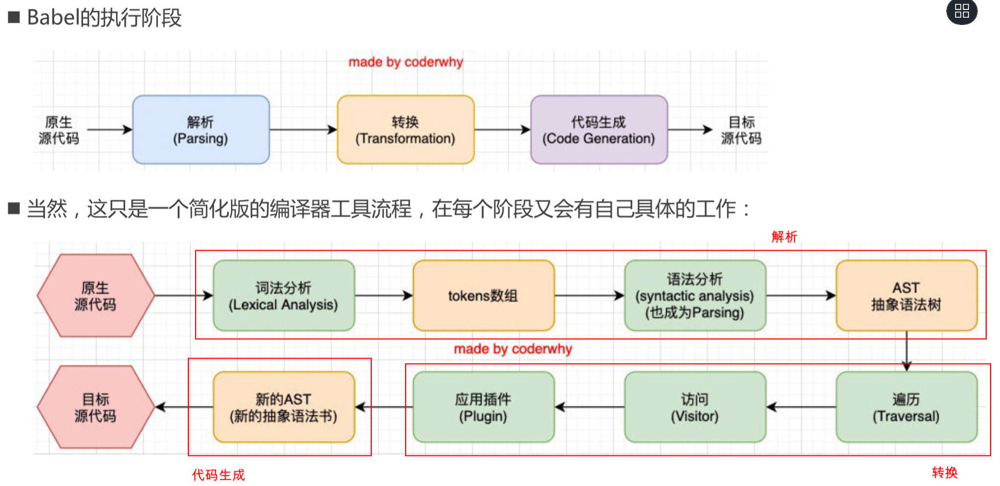

# 一、source-map 是什么？

前端工程化项目，打包后的代码，运行在浏览器上，是经过压缩的：
- 比如：babel 会将 ES6 代码转换成 ES5；
- 比如：压缩后，代码行号、列号，会不一致；
- 比如：丑化压缩时，变量名称会改变；
- 比如：TS 经由 babel 转成 JS；

也就是说，打包后的代码，在浏览器运行报错，需要调试时（debug），是很困难的。

要正确地调试压缩后的代码,需要 source-map 映射文件。它可将压缩的代码，映射到源文件；

浏览器加载 source-map 映射文件，重构原始源，并在调试器中，显示重建的原始源；

:egg: 案例理解1：

编写一个报错的文件。

demo-project\02-source-map\src\main.js

```js
const msg = 'Hello Frog'
console.log(msg)
console.log(address) // 会报错的代码

const foo = () => {
  console.log('foo function exec~')
}
foo()
```

在 `webpack.config.js` 配置文件中，配置 `mode: development`；

demo-project\02-source-map\webpack.config.js

```js
const path = require('path')

module.exports = {
  mode: 'development',
  entry: './src/main.js',
  output: {
    path: path.resolve(__dirname, './build'),
    filename: 'boundle.js'
  }
}
```

打包项目。

```shell
npx webpack
```

生成的 `build/boundle.js` 文件如下：

demo-project\02-source-map\build\boundle.js

```js
/*
 * ATTENTION: The "eval" devtool has been used (maybe by default in mode: "development").
 * This devtool is neither made for production nor for readable output files.
 * It uses "eval()" calls to create a separate source file in the browser devtools.
 * If you are trying to read the output file, select a different devtool (https://webpack.js.org/configuration/devtool/)
 * or disable the default devtool with "devtool: false".
 * If you are looking for production-ready output files, see mode: "production" (https://webpack.js.org/configuration/mode/).
 */
/******/ (() => { // webpackBootstrap
/******/ 	var __webpack_modules__ = ({

/***/ "./src/main.js":
/*!*********************!*\
  !*** ./src/main.js ***!
  \*********************/
/***/ (() => {

eval("// import { add, sub } from './utils/math';\n\nconst msg = 'Hello Frog'\nconsole.log(msg)\nconsole.log(address)\n\nconst foo = () => {\n  console.log('foo function exec~')\n}\nfoo()\n\n// console.log(add(20, 30))\n// console.log(sub(20, 30))\n\n\n//# sourceURL=webpack://02-source-map/./src/main.js?");

/***/ })

/******/ 	});
/************************************************************************/
/******/
/******/ 	// startup
/******/ 	// Load entry module and return exports
/******/ 	// This entry module can't be inlined because the eval devtool is used.
/******/ 	var __webpack_exports__ = {};
/******/ 	__webpack_modules__["./src/main.js"]();
/******/
/******/ })()
;
```

在 `index.html` 文件中，引入 `build/bundle.js` 文件，

demo-project\02-source-map\index.html

```html
<!DOCTYPE html>
<html lang="en">
<head>
  <meta charset="UTF-8">
  <meta http-equiv="X-UA-Compatible" content="IE=edge">
  <meta name="viewport" content="width=device-width, initial-scale=1.0">
  <title>Document</title>
</head>
<body>
  <h1>哈哈</h1>

  <script src="./build/boundle.js"></script>
</body>
</html>
```

使用 liveServer 打开 `iundex.html` 文件，竟然正确地显示了错误信息出现在哪。

```
in.js:5 Uncaught ReferenceError: address is not defined
    at eval (main.js:5:13)
    at ./src/main.js (boundle.js:18:1)
    at boundle.js:29:47
    at boundle.js:31:12
```

:egg: 案例理解2

在 `webpack.config.js` 配置文件中，配置 `devtool: "source-map"`；

demo-project\02-source-map\webpack.config.js

```js
const path = require('path')

module.exports = {
  mode: 'development',
  devtool: 'source-map',
  entry: './src/main.js',
  output: {
    path: path.resolve(__dirname, './build'),
    filename: 'boundle.js'
  }
}
```

执行 webpack 打包命令。

```shell
npx webpack
```

在 build 目录下，生成 `boundle.js` 文件。

demo-project\02-source-map\build\boundle.js

```js
/******/ (() => { // webpackBootstrap
var __webpack_exports__ = {};
/*!*********************!*\
  !*** ./src/main.js ***!
  \*********************/
// import { add, sub } from './utils/math';

const msg = 'Hello Frog'
console.log(msg)
console.log(address)

const foo = () => {
  console.log('foo function exec~')
}
foo()

// console.log(add(20, 30))
// console.log(sub(20, 30))

/******/ })()
;
//# sourceMappingURL=boundle.js.map
```

在 build 目录下，生成了 `bundle.js.map` 文件。

```json
{"version":3,"file":"boundle.js","mappings":";;;;;AAAA,YAAY,WAAW;;AAEvB;AACA;AACA;;AAEA;AACA;AACA;AACA;;AAEA;AACA","sources":["webpack://02-source-map/./src/main.js"],"sourcesContent":["// import { add, sub } from './utils/math';\n\nconst msg = 'Hello Frog'\nconsole.log(msg)\nconsole.log(address)\n\nconst foo = () => {\n  console.log('foo function exec~')\n}\nfoo()\n\n// console.log(add(20, 30))\n// console.log(sub(20, 30))\n"],"names":[],"sourceRoot":""}
```

# 二、source-map 使用

使用 source-map，有两个步骤：
1. webpack 在打包时，配置 `devtool` 根据源文件，生成 source-map 文件；

2. 打包好的代码，最后添加了一个注释，它指向 source-map 文件，比如：

   ```js
   //# sourceMappingURL=common.bundle.js.map
   ```

浏览器会根据注释，查找并加载 source-map；还原源代码，方便进行调试。

> 在 Chrome 中，默认开启了 source-map 的功能，如果未开启，要先开启。

# 三、source-map 分析

最初，生成的 source-map 文件大小,是原始文件的 10 倍;

第二版，减少了约 50%；第三版，又减少了 50%；

所以目前，一个 133kb 的文件，最终的 source-map 的大小，大概在 300kb。

目前的 source-map 文件，通常有如下属性：
- `version`：当前使用的版本，一般是最新的第三版；
- `sources`：源文件；
- `names`：源文件的变量和属性名称（上方案例使用的是 `development` 模式，所以没有保留转换前的名称）；
- `mappings`：源文件映射的信息（比如位置信息等）；
  - 是一串 base64 VLQ（veriable-length quantity 可变长度值）编码；
- `file`：打包后的文件（浏览器加载的文件）；
- `sourceContent`：转换前的具体代码信息（和 `sources` 是对应的关系）；
- `sourceRoot`：所有的 `sources` 相对的根目录；

浏览器会根据 source-map 文件，还原出源代码。

# 四、source-map 生成

在 `webpack.config.js` 配置文件中，`devtool` 选项，可配置很多值（目前是 26 个），来处理 source-map；

详见[官方文档](https://webpack.docschina.org/configuration/devtool/)；

选择不同的值，生成的 source-map 会稍微有差异，打包的过程也会有性能的差异，可以根据不同的情况进行选择；

下面几个值不会生成 source-map：

- `false`：不使用 source-map，也就是没有任何和 source-map 相关的内容。
- `none`：`production` 模式下的默认值（什么值都不写） ，不生成 source-map。
- `eval`：`development` 模式下的默认值，不生成 source-map；
  - 但会在 `eval` 执行的代码中，添加 `//# sourceURL=`；
  - 浏览器在执行时解析，并且在调试面板中，生成对应的一些文件目录，方便调试代码；
  - 也就是说，该值（”eval“）可以还原出源代码，但没有那么准确。

生产环境，一般设置 `devtool: none`，

开发环境，一般设置 `devtool: eval`，或 `source-map`；方便快速编译和调试。

`devtool` 可设置如下值：

## 1."eval"

见上方[一、source-map 是什么？](#一、source-map 是什么？)，案例理解1.

## 2."source-map"

会生成一个独立的 source-map 文件，并在 `bundle.js` 文件中有一个注释，指向 source-map 文件；

浏览器会根据这个注释，找到 source-map 文件，解析，还原出源文件；

见上方[一、source-map 是什么？](#一、source-map 是什么？)，案例理解2.

## 3.“eval-source-map”

会生成 source-map;

不过，是在 `boundle.js` 中，以 DataUrl 添加到 eval 函数的后面的。

demo-project\02-source-map\build\boundle.js

```js
/*
 * ATTENTION: An "eval-source-map" devtool has been used.
 * This devtool is neither made for production nor for readable output files.
 * It uses "eval()" calls to create a separate source file with attached SourceMaps in the browser devtools.
 * If you are trying to read the output file, select a different devtool (https://webpack.js.org/configuration/devtool/)
 * or disable the default devtool with "devtool: false".
 * If you are looking for production-ready output files, see mode: "production" (https://webpack.js.org/configuration/mode/).
 */
/******/ (() => { // webpackBootstrap
/******/ 	var __webpack_modules__ = ({

/***/ "./src/main.js":
/*!*********************!*\
  !*** ./src/main.js ***!
  \*********************/
/***/ (() => {

eval("// import { add, sub } from './utils/math';\n\nconst msg = 'Hello Frog'\nconsole.log(msg)\nconsole.log(address)\n\nconst foo = () => {\n  console.log('foo function exec~')\n}\nfoo()\n\n// console.log(add(20, 30))\n// console.log(sub(20, 30))\n//# sourceURL=[module]\n//# sourceMappingURL=data:application/json;charset=utf-8;base64,eyJ2ZXJzaW9uIjozLCJmaWxlIjoiLi9zcmMvbWFpbi5qcy5qcyIsIm1hcHBpbmdzIjoiQUFBQSxZQUFZLFdBQVc7O0FBRXZCO0FBQ0E7QUFDQTs7QUFFQTtBQUNBO0FBQ0E7QUFDQTs7QUFFQTtBQUNBIiwic291cmNlcyI6WyJ3ZWJwYWNrOi8vMDItc291cmNlLW1hcC8uL3NyYy9tYWluLmpzPzU2ZDciXSwic291cmNlc0NvbnRlbnQiOlsiLy8gaW1wb3J0IHsgYWRkLCBzdWIgfSBmcm9tICcuL3V0aWxzL21hdGgnO1xuXG5jb25zdCBtc2cgPSAnSGVsbG8gRnJvZydcbmNvbnNvbGUubG9nKG1zZylcbmNvbnNvbGUubG9nKGFkZHJlc3MpXG5cbmNvbnN0IGZvbyA9ICgpID0+IHtcbiAgY29uc29sZS5sb2coJ2ZvbyBmdW5jdGlvbiBleGVjficpXG59XG5mb28oKVxuXG4vLyBjb25zb2xlLmxvZyhhZGQoMjAsIDMwKSlcbi8vIGNvbnNvbGUubG9nKHN1YigyMCwgMzApKVxuIl0sIm5hbWVzIjpbXSwic291cmNlUm9vdCI6IiJ9\n//# sourceURL=webpack-internal:///./src/main.js\n");

/***/ })

/******/ 	});
/************************************************************************/
/******/
/******/ 	// startup
/******/ 	// Load entry module and return exports
/******/ 	// This entry module can't be inlined because the eval-source-map devtool is used.
/******/ 	var __webpack_exports__ = {};
/******/ 	__webpack_modules__["./src/main.js"]();
/******/
/******/ })()
;
```

## 4."inline-source-map"

会生成 source-map;

不过，是在 `boundle.js` 文件中，以 DataUrl 添加到文件的后方。

demo-project\02-source-map\build\boundle.js

```js
/******/ (() => { // webpackBootstrap
var __webpack_exports__ = {};
/*!*********************!*\
  !*** ./src/main.js ***!
  \*********************/
// import { add, sub } from './utils/math';

const msg = 'Hello Frog'
console.log(msg)
console.log(address)

const foo = () => {
  console.log('foo function exec~')
}
foo()

// console.log(add(20, 30))
// console.log(sub(20, 30))

/******/ })()
;
//# sourceMappingURL=data:application/json;charset=utf-8;base64,eyJ2ZXJzaW9uIjozLCJmaWxlIjoiYm91bmRsZS5qcyIsIm1hcHBpbmdzIjoiOzs7OztBQUFBLFlBQVksV0FBVzs7QUFFdkI7QUFDQTtBQUNBOztBQUVBO0FBQ0E7QUFDQTtBQUNBOztBQUVBO0FBQ0EiLCJzb3VyY2VzIjpbIndlYnBhY2s6Ly8wMi1zb3VyY2UtbWFwLy4vc3JjL21haW4uanMiXSwic291cmNlc0NvbnRlbnQiOlsiLy8gaW1wb3J0IHsgYWRkLCBzdWIgfSBmcm9tICcuL3V0aWxzL21hdGgnO1xuXG5jb25zdCBtc2cgPSAnSGVsbG8gRnJvZydcbmNvbnNvbGUubG9nKG1zZylcbmNvbnNvbGUubG9nKGFkZHJlc3MpXG5cbmNvbnN0IGZvbyA9ICgpID0+IHtcbiAgY29uc29sZS5sb2coJ2ZvbyBmdW5jdGlvbiBleGVjficpXG59XG5mb28oKVxuXG4vLyBjb25zb2xlLmxvZyhhZGQoMjAsIDMwKSlcbi8vIGNvbnNvbGUubG9nKHN1YigyMCwgMzApKVxuIl0sIm5hbWVzIjpbXSwic291cmNlUm9vdCI6IiJ9
```

## 5."cheap-source-map"

会生成 source-map

不过，会更加高效一些（”cheap“在编程中，意为低开销）；

没有生成列映射（Column Mapping），在开发中，通常只需要行信息，就可以定位到错误了.

demo-project\02-source-map\build\boundle.js

```js
/******/ (() => { // webpackBootstrap
var __webpack_exports__ = {};
/*!*********************!*\
  !*** ./src/main.js ***!
  \*********************/
// import { add, sub } from './utils/math';

const msg = 'Hello Frog'
console.log(msg)
console.log(address)

const foo = () => {
  console.log('foo function exec~')
}
foo()

// console.log(add(20, 30))
// console.log(sub(20, 30))

/******/ })()
;
//# sourceMappingURL=boundle.js.map
```

demo-project\02-source-map\build\boundle.js.map

```json
{"version":3,"file":"boundle.js","mappings":";;;;;AAAA;AACA;AACA;AACA;AACA;AACA;AACA;AACA;AACA;AACA;AACA;AACA;AACA","sources":["webpack://02-source-map/./src/main.js"],"sourcesContent":["// import { add, sub } from './utils/math';\n\nconst msg = 'Hello Frog'\nconsole.log(msg)\nconsole.log(address)\n\nconst foo = () => {\n  console.log('foo function exec~')\n}\nfoo()\n\n// console.log(add(20, 30))\n// console.log(sub(20, 30))\n"],"names":[],"sourceRoot":""}
```

## 6."cheap-module-source-map"

会生成 sourcemap；

类似于 “cheap-source-map”，但是对源自 loader 的 sourcemap 处理会更好。

如果 loader 对源码进行了特殊的处理，那么使用该值，

- 比如，能准确映射 babel-loader 转化后的代码；

## 7.“hidden-source-map”

会生成 sourcemap；

不过，在 `boundle.js` 文件中，不会对 source-map 文件进行引用；

```js
// 被删除掉的 //# sourceMappingURL=bundle.js.map
```

如果手动添加，那么 sourcemap 就会生效了。

## 8.“nosources-source-map”

会生成 sourcemap；

不过，生成的 sourcemap 只有错误信息的提示，不会生成源代码文件；

demo-project\02-source-map\build\boundle.js

```js
/******/ (() => { // webpackBootstrap
var __webpack_exports__ = {};
/*!*********************!*\
  !*** ./src/main.js ***!
  \*********************/
// import { add, sub } from './utils/math';

const msg = 'Hello Frog'
console.log(msg)
console.log(address)

const foo = () => {
  console.log('foo function exec~')
}
foo()

// console.log(add(20, 30))
// console.log(sub(20, 30))

/******/ })()
;
//# sourceMappingURL=boundle.js.map
```

demo-project\02-source-map\build\boundle.js.map

```json
{"version":3,"file":"boundle.js","mappings":";;;;;AAAA,YAAY,WAAW;;AAEvB;AACA;AACA;;AAEA;AACA;AACA;AACA;;AAEA;AACA","sources":["webpack://02-source-map/./src/main.js"],"names":[],"sourceRoot":""}
```

## 9.其它值

事实上，提供的 26 个值，上方没有被介绍到的，都是根据上方已介绍到的值，组合而成的。

组合的规则如下：

- `inline-|hidden-|eval`：三个值时三选一；
- `nosources`：可选值；
- `cheap`：可选值，并且可以跟随 `module` 的值；

总结：

`[inline-|hidden-|eval-][nosources-][cheap-[module-]]source-map`

## 10.如何选择

在开发中，最佳的实践：

开发阶段：`source-map` 或者 `cheap-module-source-map`； 

- 这分别是 vue 和 react 使用的值，可以获取调试信息，方便快速开发；

测试阶段：推荐使用 `source-map` 或者 `cheap-module-source-map`； 

- 测试阶段，我们也希望在浏览器下看到正确的错误提示；

发布阶段：`false`、缺省值（不写）

# 五、Babel 有什么用？

在实际开发中，开发者一般很少直接接触 babel；

但是，目前 babel 对于前端开发来说，是不可缺少的一部分： 

- 比如，开发中，使用 ES6+ 的语法、用 TypeScript、开发 Vue / React 项目...，都离不开 Babel； 

Babel 是一个工具链，最早用于在旧浏览器，或环境中将 ES6+ 代码，转成向后兼容的代码。

- 包括：语法转换、源代码转换、Polyfill 实现目标环境缺少的功能等；

Babel 本质上是一个编译器。


webpack 底层，也使用 babel 对代码进行转换。

# 六、Babel 命令行使用

创建“03_babel核心使用”项目：

## 1.基本使用

Babel 支持（脱离 webpack）在命令行单独运行：

1. 安装两个库：

   - *@babel/core*，babel 核心代码，必须安装。
   - *@babek/cli*：在命令行使用 babel。

   ```shell
   npm install @babel/core @babel/cli -D
   
   npx babel --version # 查看安装版本
   ```

2. 使用 babel 来处理源代码：

   ```shell
   npx babel src --out-dir dist --out-file main.js
   ```

## 2.插件使用

安装插件：

1. 安装“箭头函数转换”相关插件，并在命令中使用

   ```shell
   npm install @babel/plugin-transform-arrow-function -D
   ```

   ```shell
   npx babel src --out-dir dist --plugins=@babel/plugin-transform-arrow-function
   ```

2. 安装“块级作用域语法转换”插件，并在命令中使用：可将 `const` 关键字转成 `var`；

   ```shell
   npm install @babel/plugin-transform-block-scoping -D
   ```

   ```shell
   npx babel src --out-dir dist --plugins=@babel/plugin-transform-block-scoping,babel/plugin-transform-arrow-function
   ```

## 3.预设 preset

插件过多，一个个设置比较麻烦，可以使用预设：

安装 Babel 的预设，并在命令中使用。

会自动开启严格模式。

```shell
npm install @babel/preset-env -D
```

```shell
npx babel demo.js --out-dir dist --presets=@babel/preset-env
```

> 安装库的方式如 “@babel/core”，表示代码仓库通过 monoRepo 的方式来管理。

# 七、Babel 底层原理

babel 可将一段代码（ES6、TypeScript、React）转成另外一段代码.

Babel 本质上是一个**编译器**，可以将源代码，转换成浏览器可以识别的另外一段源代码；

Babel 编译器的工作流程，3 点：对应的步骤，理解原理图。

1. 解析阶段（Parsing）
   - 原生代码 -> 词法分析 -> token 数组 -> 语法分析（也称为 Parsing）-> AST
2. 转换阶段（Transformation）
   - AST -> 遍历 -> 访问 -> 应用插件
3. 生成阶段（Code Generation）
   - 应用插件 -> 新的 AST -> 目标代码



[github 上，优秀的小型编译器项目](https://github.com/jamiebuilds/the-super-tiny-compiler)

将 lisp 语言的代码，转成 C 语言的代码。
