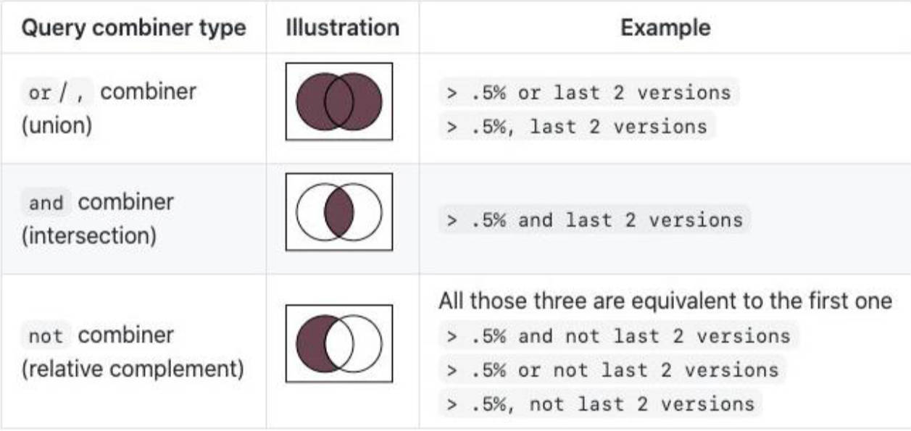

# Babel & Browserlists & Polyfill

## 一、Babel 在打包工具中使用

Babel 的预设，是根据要适配的浏览器，进行查询的，会用到 `.browserlist`。

在 webpack 中，使用 Babel。

### 1.babel-loader

1.安装 _@babel/core_，_babel-loader_；

```shell
npm install @babel/core babel-loader -D
```

### 2.babel-preset

1.安装对应的插件，预设：

```shell
npm install @babel/plugin-transform-arrow-function @babel/plugin-transform-block-scoping -D
```

如果一个个去安装插件，意味着要手动管理大量插件;

在 webpack 中，使用 babel 预设（babel preset），来加载对应的插件列表；

常见的 babel 预设，有三个：

- env
- react
- TypeScript

```shell
npm install @babel/preset-env -D
```

2.在 `webpoack.config.js` 文件中做配置：

```javascript
module.exports = {
  module: {
    rules: [
      {
        test: /\.m?js$/,
        use: {
          loader: 'babel-loader',
          options: {
            // 配置插件
            /* plugins: [
              "@babel/plugin-transform-arrow-function",
              "@babel/plugin-transform-block-scoping"
            ] */

            // 配置预设, 常见的有 env，react，TypeScript
            presets: [
              // presets 的两种写法，在数组中，做更多配置。
              '@babel/preset-env'
              // 另一种写法，用于配置预设
              // ['@babel/preset-env', {xxx: xxx}]
            ]
          }
        }
      }
    ]
  }
}
```

> 【补充】：在 `output` 中，配置 `clear`，每次打包，清空 build 文件夹；
>
> 这是新版本中的特性，以前需要插件完成。
>
> demo-project\03_babel 核心使用\webpack.config.js
>
> ```js
> const path = require('path')
>
> module.exports = {
>     mode: 'development',
>     devtool: false,
>     entry: './src/index.js',
>     output: {
>      path: path.resolve(__dirname, './build'),
>      filename: 'bundle.js',
>
>      // 重新打包时, 先将之前打包的文件夹删除掉
>      clean: true
>     },
>   ...
> }
> ```

### 3.babel 有什么用？

webpack 压缩代码后，仅有**模块化**内容；

babel 添加了代码**语法转化**的功能。

将 webpack 和 babel 结合在一起。才是我们想要的效果。

## 三、浏览器兼容性

这里指的兼容性，是指浏览器支持的代码特性：

- 比如：兼容 css 特性、js 语法的特性；（HTML 基本不需要兼容）；

前端开发，急需一些工具，帮助做代码兼容。

- CSS，一般用 _postcss_ 做转化。
- JS 一般用 _babel_ 做转化。

适配新版本浏览器时，通常不需要转化；在适配旧浏览器时，需要转换。

所以，是否要做兼容，取决于要适配的浏览器。

市面上有大量的浏览器：

- 比如 Chrome、Safari、IE、Edge、Chrome for Android、UC Browser、QQ Browser...；
- 决定是否要兼容它们，通常在脚手架中进行了配置，其中很重要的一点，是浏览器的市场占有率。

浏览器市场占有率，通常在 [caniuse](https://caniuse.com/usage-table) 则个网站进行查询；

## 四、browserslist

browserslist 工具，用于指定要兼容的浏览器。

Browserslist 为（babel、postcss 这样的）适配工具提供，用于共享目标浏览器，和 Node.js 版本的配置：

可适配以下工具：

- Autoprefixer
- Babel
- postcss-preset-env
- eslint-plugin-compat
- stylelint-no-unsupported-browser-features
- postcss-normalize
- obsolete-webpack-plugin

### 1.查询流程

编写类似于这样的配置：

```browserlist
> 1%
last 2 versions
not dead
```

_browserslist_ 工具，用来获取符合条件的浏览器信息，以决定是否需要进行兼容性的支持：其中引用了 caniuse-lite 工具；

_caniuse-lite_ 工具，用于条件查询，数据，来自于 caniuse 的网站上；

demo-project\03_babel 核心使用\node_modules\browserslist\index.js

```js
var agents = require('caniuse-lite/dist/unpacker/agents').agents
```

### 2.编写规则

#### 1.常用

browserslist 常用的编写的条件如下：

`defaults`：默认条件（`> 0.5%, last 2 versions, Firefox ESR, not dead`）。

`5%`：浏览器市场占有率，与 `>=`、`<`、`<=`...结合使用；

- `5% in US`：美国的市场占有率（接受两个字母的国家/地区代码）。
- `> 5% in alt-AS`：亚洲地区市场占有率（有关所有区域代码的列表，详见[文档](https://caniuse-lite/data/regions)）
- `> 5% in my stats`：使用自定义用法数据。
- `> 5% in browserslist-config-mycompany stats`：使用自定义情况数据 browserslist-config-mycompany/browserslist-stats.json。
- `cover 99.5%`：提供覆盖率的最受欢迎的浏览器。
- `cover 99.5% in US`：与上述相同，但国家/地区代码由两个字母组成。
- `cover 99.5% in my stats`：使用自定义用法数据。

`dead`：24 个月内，没有官方支持，或更新的浏览器。

- 现在是 IE 10，IE_Mob 11，BlackBerry 10，BlackBerry 7，Samsung 4、OperaMobile 12.1。

`last 2 versions`：每个浏览器的最后 2 个版本。

- `last 2 Chrome versions`：最近 2 个版本的 Chrome 浏览器。
- `last 2 major versions`、`last 2 iOS major versions`：最近 2 个主要版本的所有次要/补丁版本。

#### 2.不常用

`node 10`、`node 10.4`：选择最新的 Node.js 10.x.x 或 10.4.x 版本。

- `current node：Browserslist`：现在使用的 Node.js 版本。
- `maintained node versions`：所有 Node.js 版本，仍由 Node.js Foundation 维护。

`iOS 7`：直接使用 iOS 浏览器版本 7。

- `Firefox > 20`：Firefox 的版本高于 20 >=，< 并且 <= 也可以使用。它也可以与 Node.js 一起使用。
- `ie 6-8`：选择一个包含范围的版本。
- `Firefox ESR`：最新的 Firefox ESR 版本。
  - 为专门的组织、学校提供的版本
- `PhantomJS 2.1`、`PhantomJS 1.9`：选择类似于 PhantomJS 运行时的 Safari 版本。

`extends browserslist-config-mycompany`：从 browserslist-config-mycompanynpm 包中查询。

`supports es6-module`：支持特定功能的浏览器。

- es6-module 这是“我可以使用”页面 feat 的 URL 上的参数。有关所有可用功能的列表，请参见。caniuse-lite/data/features

`browserslist config`：在 Browserslist 配置中定义的浏览器。在差异服务中很有用，可用于修改用户的配置；

- 例如 browserslist config and supports es6-module。

`since 2015` 或 `last 2 years`：自 2015 年以来，发布的所有版本（since 2015-03 以及 since 2015-03-10）。

`unreleased versions`、`unreleased Chrome versions`：Alpha、Beta 版本。

`not ie <= 8`：排除先前查询选择的浏览器。

### 3.在命令行使用

安装 Babel 后，自带了 _browserslist_ 工具和 _caniuse-lite_ 工具。

运行命令：

```shell
npx browserslist ">1%, last 2 version, not dead" # 条件之间是“或”的关系。
```

结果为：

```shell
and_chr 107
and_ff 106
and_qq 13.1
and_uc 13.4
android 107
chrome 107
chrome 106
chrome 105
edge 107
edge 106
firefox 107
firefox 106
firefox 105
ios_saf 16.1
ios_saf 16.0
ios_saf 15.6
kaios 2.5
op_mini all
op_mob 72
opera 92
opera 91
safari 16.1
safari 16.0
safari 15.6
samsung 19.0
samsung 18.0
```

### 4.配置

配置 browserslist 两种方案：

方案一：在 `package.json` 中配置；

demo-project\03_babel 核心使用\package.json

```json
{
  "browserslist": ["> 0.2%", "last 2 version", "not dead"]
}
```

方案二：单独的一个配置文件 `.browserslistrc` 文件；

demo-project\03_babel 核心使用\.browserslistrc

```browserslist
> 0.1%
last 2 versions
not dead
```

如没有配置，browserslist 会应用一个默认配置：

```js
browserslist.defaults = ['> 0.5%', 'last 2 version', 'Firefox ESR', 'not dead']
```

当编写了多个条件之后，多个条件之间是什么关系呢？



> 【面试】：回答如何做浏览器适配，本质上要介绍工具，postcss，babel，browserslist，caniuse-lite。

## 九、浏览器适配方式

### 1.browserslist

上面介绍的，都是使用了 browserslist 工具，进行统一适配；

事实上，还可以在转化工具中，使用 `targets` 属性，进行适配（开发中很少使用）。

### 2.targets

通过 `targets` 属性，进行配置，会覆盖 browserslist 的配置；：

demo-project\03_babel 核心使用\babel.config.js

```js
module.exports = {
  presets: [
    [
      '@babel/preset-env',
      {
        // 在开发中针对 babel 的浏览器兼容查询，使用 browserslist 工具, 而不是设置 target
        // 因为 browserslist 工具, 可以在多个前端工具之间进行共享浏览器兼容性(postcss/babel)
        targets: '>5%'
      }
    ]
  ]
}
```

### 3.如何选择？

在开发中，推荐使用 browserslist 来配置；进行统一浏览器的适配；

## 十、Stage-X 是什么？

要了解 Stage-X，要先了解 **TC39** 的组织：

TC39 指：“技术委员会（Technical Committee）第 39 号”；它是 ECMA 的一部分；

ECMA 是 “ECMAScript” 规范下的 JavaScript 语言标准化的机构；

ECMAScript 规范，定义了 JavaScript 如何一步一步的进化、发展；

TC39 遵循的原则是：分阶段加入不同的语言特性，新流程涉及四个不同的 Stage

- Stage 0：strawman（稻草人），任何尚未提交作为正式提案的讨论、想法变更或者补充，都被认为是第 0 阶段的"稻草人"；
- Stage 1：proposal（提议），提案已经被正式化，并期望解决此问题，还需要观察与其他提案的相互影响；
- Stage 2：draft（草稿），Stage 2 的提案应提供规范初稿、草稿；
  - 此时，语言的实现者开始观察 runtime 的具体实现是否合理；
- Stage 3：candidate（候补），建议的候选提案。在这个高级阶段，规范的编辑人员和评审人员必须在最终规范上签字;
  - 该阶段的提案，不会有太大的改变，在对外发布之前只是修正一些问题；
- Stage 4：finished（完成），进入 Stage 4 的提案将包含在 ECMAScript 的下一个修订版中；

## 十一、Babel 的 Stage-X 设置

babel 7 之前，经常看到这种设置方式：

demo-project\03_babel 核心使用\babel.config.js

```js
module.exports = {
  presets: ['stage-0']
}
```

表达使用 _babel-preset-stage-x_ 预设；

从 babel 7 开始，不建议使用了，取而代之的是 `preset-env`；

demo-project\03_babel 核心使用\babel.config.js

```js
module.exports = {
  presets: ['@babel/preset-env']
}
```

## 十二、babel 两种配置文件

将 babel 的配置信息，放到一个独立的文件中，有两种配置文件的编写方式：

`babel.config.json`（或者 .js，.cjs，.mjs）文件；

- babel7 之后的方案：可以直接作用于 Monorepos 项目的子包（推荐）；
- 目前很多的项目，都采用了多包管理的方式（babel、element-plus、umi...）；

`.babelrc.json`（或者 .babelrc，.js，.cjs，.mjs）文件；

- 早期使用较多的配置方式，对于配置 Monorepos 项目是比较麻烦的；

> 【补充】：Monorepos 项目（常见于第三方框架的项目）：
>
> 一个项目，很多子包：
>
> - core/package.json
> - preset-env/package.json
> - arrow-function/package.json
> - ...

## 十三、polyfill 是什么？

Polyfill 直译为：一种用于衣物、床具的聚酯填充材料, 使这些物品更加温暖舒适；

前端开发中，表示：填充物（垫片），一个补丁，可以帮助我们更好的使用 JavaScript；

有什么用？

babel 将高级语法特性，转成向下兼容的语法，但有些 API，没法转换；

当使用了一些 **API 特性**（例如：Promise, Generator, Symbol、实例方法例如 Array.prototype.includes...）

就需要使用 polyfill，来填充，或者说打一个补丁，使得浏览器，才能够正确的转换代码；

polyfill 就是把没有的 API，填充进来。

## 十四、polyfill 的使用

babel7.4.0 之前，使用 _@babel/polyfill_ 包，现已不推荐使用：

babel7.4.0 之后，单独引入 _core-js_ 和 _regenerator-runtime_ 来使用 polyfill：

```shell
npm install core-js regenerator-runtime # 生产环境和开发阶段都需要该依赖。
```

在 `babel.config.js` 中，配置。

demo-project\03_babel 核心使用\babel.config.js

```js
module.exports = {
  presets: [
    [
      '@babel/preset-env',
      {
        corejs: 3,
        useBuiltIns: 'entry'
      }
    ]
  ]
}
```

`corejs`：设置 corejs 的版本，目前使用较多的是 3.x 的版本；

- 另外 corejs 可以设置是否对”提议（proposal）“阶段的特性进行支持；设置 proposals 属性为 `true` 即可；

`useBuiltIns`：设置以什么样的方式，来使用 polyfill，常见的有 3 个值；

- `false`

  - 打包后的文件，不使用 polyfill 来进行适配；
  - 并且这时，不需要设置 `corejs` 属性的；

- `usage`（推荐使用）

  - 根据源代码中，出现的语言特性，自动检测所需要的 `polyfill`；
  - 确保，最终打包里的 polyfill 数量最小化；

- `entry`

  - 如果依赖的某一个库，本身使用了某些 polyfill 的特性，这时使用 `usage`，用户浏览器可能会报错；

  - 如果你担心出现这种情况，可以使用 `entry`；

  - 并且需要在入口文件中添加

    ```js
    import 'core-js/stable';
    import 'regenerator-runtime/runtime
    ```

  - 这样做，会根据 browserslist 目标，导入所有的 polyfill，但是对应的包也会变大；
