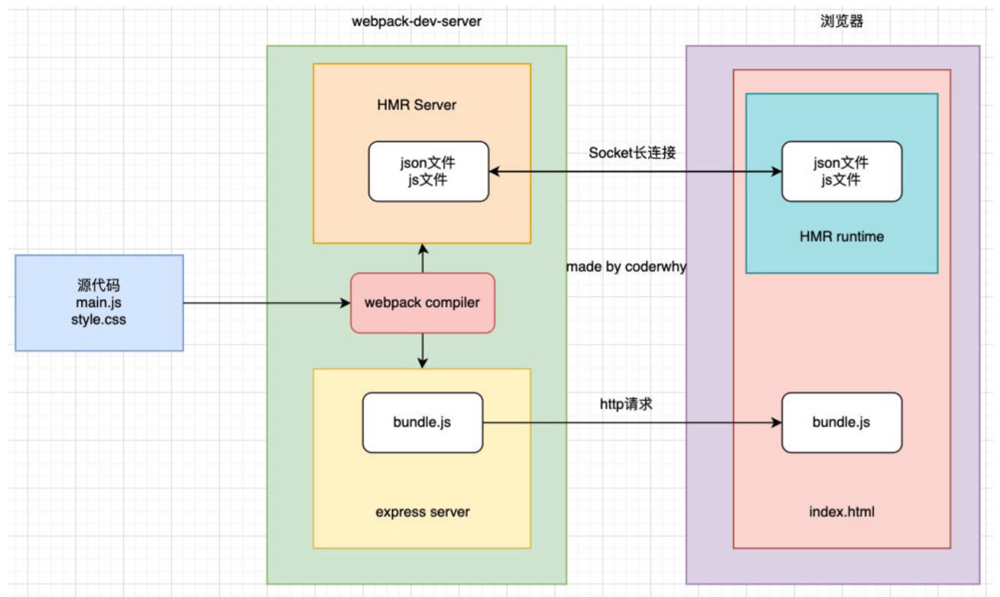

# babel & webpack-server-proxy

## 一、React jsx 编译

使用 babel，对 react jsx 代码进行处理，需要如下的插件：

- @babel/plugin-syntax-jsx
- @babel/plugin-transform-react-jsx
- @babel/plugin-transform-react-display-name

同样的，在开发中，不需要一个个去安装这些插件；

使用 preset 来配置即可：

安装 _@babel/preset-react_

```shell
npm install @babel/preset-react -D
```

demo-project\04_webpack 服务器\babel.config.js

```js
module.exports = {
  presets: [['@babel/preset-env'], ['@babel/preset-react']]
}
```

---

在项目中，安装 rect、react-dom

```shell
npm install react react-dom
```

编写一个 React 组件 `App.jsx`

demo-project\04_webpack 服务器\src\react\App.jsx

```jsx
import React, { memo, useState } from 'react'

const App = memo(() => {
  const [count, setCount] = useState(0)

  return (
    <div>
      <h1>App Count: {count}</h1>
      <button onClick={e => setCount(count + 1)}>+1</button>
    </div>
  )
})

export default App
```

创建一个模板 `index.html`；

demo-project\04_webpack 服务器\index.html

```html
<!DOCTYPE html>
<html lang="en">
  <head>
    <meta charset="UTF-8" />
    <meta http-equiv="X-UA-Compatible" content="IE=edge" />
    <meta name="viewport" content="width=device-width, initial-scale=1.0" />
    <title>Document</title>
  </head>
  <body>
    <div id="root"></div>
  </body>
</html>
```

将 react 渲染到 `div#root` 中：

demo-project\04_webpack 服务器\src\index.js

```js
import App from './react/App'

// 5.编写react代码
const root = ReactDom.createRoot(document.querySelector('#root'))
root.render(<App />)
```

对 html 模板文件，进行打包处理，并添加到打包目录下，引用打包后的 js 文件。

安装 _html-webpack-plugin_ 插件。

```shell
npm install html-webpack-plugin -D
```

使用该插件。

demo-project\04_webpack 服务器\webpack.config.js

```js
const HtmlWebpackPlugin = require('html-webpack-plugin')

module.exports = {
  plugin: [
    new HtmlWebpackPlugin({
      template: './index.html' // 指定模板文件路径。
    })
  ]
}
```

> js 中也可以写 jsx 代码。

### 1.resolve extensions

webpack 中 [resolve extensions 配置](https://webpack.docschina.org/configuration/resolve/#resolveextensions)，有三个默认值。

打包时，解析添加的后缀名

demo-project\04_webpack 服务器\webpack.config.js

```js
module.exports = {
  //...
  resolve: {
    extensions: ['.js', '.json', '.wasm', '.jsx', '.ts'] // 前 3 个是默认值
  }
}
```

## 二、TypeScript 编译

TypeScript 代码，最终需要转换成 JavaScript 代码。

### 1.tsc

通过 TypeScript 的 compiler（tsc），将 TS 转换成 JS：

安装 tsc

```shell
npm install typescript -D
```

TypeScript 会根据 `tsconfig.json` 文件，进行编译，初始化该配置文件：

```shell
tsc --init
```

使用 tsc 编译代码：

```shell
npx tsc
```

### 2.ts-loader

webpack 编译 TypeScript 代码。使用 _ts-loader_

安装 _ts-loader_

```shell
npm install ts-loader -D
```

配置 ts-loader：

demo-project\04_webpack 服务器\webpack.config.js

```js
module.exports = {
  module: {
    rules: [
      {
        test: /\.ts$/,
        exclude: /node_modules/,
        use: 'ts-loader'
      }
    ]
  }
}
```

执行打包命令：

```shell
npm run build
```

> 安装 _ts-loader_ 时，会自动安装 _typescript_。本质上还是在用 tsc 编译代码。

### 3.babel-loader

开发中，通常不使用 tsc / ts-loader，编译 TS 代码，而是 babel-loader。

- Babel 提供了对 TypeScript 代码转换的支持；
- 可以使用插件：_@babel/tranform-typescript_；
- 更推荐使用预设：即 _@babel/preset-typescript_；

安装 _@babel/preset-typescript_：

```shell
npm install @babel/preset-typescript -D
```

配置 babel-loader

demo-project\04_webpack 服务器\babel.config.js

```js
module.exports = {
  presets: [
    ['@babel/preset-env'],
    ['@babel/preset-react'],
    [
      '@babel/preset-typescript',
      {
        corejs: 3,
        useBuiltIns: 'usage'
      }
    ]
  ]
}
```

### 4.总结

使用 ts-loader（TypeScript Compiler）

- 来直接编译 TypeScript，只能将 ts 转换成 js；
- 如果还要添加 polyfill，那么是无能为力的；需要借助于 babel；

使用 babel-loader（Babel）

- 可直接编译 TypeScript，将 ts 转换成 js，并且可以添加 polyfill 的功能；
- 但是，不会对类型进行检测；

在开发中，同时满足代码转换和 polyfill 添加，需要使用如下最佳实践方案。

### 5.最佳实践

[TypeScript 官方文档](https://www.typescriptlang.org/docs/handbook/babel-with-typescript.html)，有对其进行说明：

既使用 babel 来完成代码的转换；

也使用 tsc 来进行类型的检查。

1.在 "scripts" 中添加了两个脚本，用于类型检查；

demo-project\04_webpack 服务器\package.json

```json
{
  "scripts": {
    "test": "echo \"Error: no test specified\" && exit 1",
    "build": "webpack",
    "serve": "webpack serve",
    "ts-check": "tsc --noEmit",
    "ts-check-watch": "tsc --noEmit --watch"
  }
}
```

2.执行如下命令，可以对 ts 的类型进行检测；

```shell
npm run type-check
```

3.执行如下命令，可以实时的检测 ts 的类型进行检测；

```shell
npm run type-check-watch
```

## 三、webpack 本地服务器

webpack 打包的代码，为了运行，需要有两个操作：

操作一：编译相关的代码；

```shell
npm run build
```

操作二：通过 liveServer，或者直接使用浏览器，打开 `index.html` 代码，查看效果；

这个过程效率低，如果当文件发生变化时，可以自动的完成编译和刷新就好了；

webpack 中，提供了 3 种自动编译的方式。

- webpack watch mode
- webpack-dev-server（常用）
- webpack-dev-middleware（中间件）（不常用）

## 四、webpack watch

webpack 提供了 `watch` 模式；

在该模式下，webpack 依赖图中的所有文件，只要有一个发生了更新，那么代码将被重新编译。

开启 watch 模式：在 `webpack.config.json` 中进行配置

```javascript
module.exports = {
  watch: true
}
```

在 `package.json` 中配置 "script"：

```json
"script": {
  "watch": "webpack --watch"
}
```

watch 模式的缺点：没有具备 live loading（热加载）的功能，自动重新编译后，需要刷新页面才有效果。

## 五、webpack-dev-server

webpack-dev-server 可实现：项目文件更新后，自动编译和热加载（live loading）。

1.安装 webpack-dev-server

```shell
npm install webpack-dev-server -D
```

2.配置 `package.json` 文件：

demo-project\04_webpack 服务器\package.json

```json
"script": {
  "serve": "webpack serve"
}
```

使用 webpack-dev-server 的注意事项：

- webpack3 以前，需要从 webpack-dev-server 启动服务，现在有了 webpack-cli，当发现命令中有 `serve`，会自动启动。
- webpack-dev-server 会基于 express 框架，搭建一个本地服务。
- webpack-dev-server 在编译之后，不会输出任何文件，而是将打包后的文件**保留在内存中**。
  - 事实上 webpack-dev-server 使用了一个库叫 _memfs_（_memory-fs_，webpack 自己写的）

### 1.static

devServer 中的 `contentBase` 已弃用；

代替它的是 `static` 属性。

`devServer` 中 `static`，对于访问打包后的资源，其实并没有太大的作用；

它的主要作用是：指定从哪里来查找，打包后的资源，所依赖的一些资源；

- 比如在 `index.html` 中，需要依赖一个 `abc.js` 文件，这个文件存放在 `public` 文件夹中；
- 在 `index.html` 中，要去引入这个文件？

  - 这样引入：`<script src="./public/abc.js"></script>`；打包后，浏览器是无法通过相对路径，去找到这个文件夹的；
  - 所以，应该这样引入：`<script src="/abc.js"></script>`；再使用 `static` 属性，让 `index.html` 去查找到这个文件的存在

`static` 属性，可以：

1. 指定一个目录进行访问。（在 _CopyWebpackPlugin_ 插件中，要复制的文件，可放在 `static` 指定的目录下；

2. 在开发阶段使用，不轻易的对所有资源打包，提高效率

配置 `devServer` 中的 `static`：

demo-project\04_webpack 服务器\webpack.config.js

```javascript
module.exports = {
  devServer: {
    // contentBase: "./public"
    static: ['public', 'content']
  }
}
```

### 2.hot（HMR）

HMR 全称是 Hot Module Replacement，译为“模块热替换”；

指的是，在应用程序运行中，替换，添加，删除模块，而无需刷新整个页面（模块通常指文件）。

HMR 的好处，2 点：

- 不重新加载页面，保留应用程序某些状态不丢失。
- 只更新变化的内容，节省开发的时间。
- 修改了 css、js 源代码，会在浏览器立即更新，相当于直接在浏览器的 devtools 中修改样式；

基于 webpack-dev-server，使用 HMR。

1. 配置 `webpack.config.json` 文件：

   ```javascript
   module.exports = {
     target: 'web', // 最好配置，意思是为 web 环境打包。
     devServer: {
       hot: true
     }
   }
   ```

2. 在编写的代码中，指定哪个模块发生变更时，进行 HMR：

   ```javascript
   import './js/util.js' // 需要先引入模块。

   if (module.hot) {
     module.hot.accept('./js/util.js', () => {
       console.log('util更新了')
     })
   }
   ```

#### 1.HMR 原理

在实际开发项目时，不需要经常手动写 `module.hot.accept` 代码；2 个例子：

- vue 开发中，_vue-loader_ 支持 vue 组件的 HMR，提供开箱即用的体验。
- react 开发中，_react-refresh_（_React Hot Loader_ 已弃用）实时调整 react 组件。

HMR 原理的理解，2 方面，。

webpack-dev-server 会创建两个服务：

- express server
  1. 负责直接提供静态资源服务（打包后的资源，被浏览器请求和解析）
- Socket Server
  1. webpack compiler 监听到对应模块发生变化时，生成两个文件：.json（ manifest 文件）和 .js 文件（update chunk）。
  2. 将这两个文件，主动发送给客户端（浏览器）
  3. 浏览器通过 HMR runtime 机制，加载这两个文件，针对修改的模块做更新。

理解原理图



> 【补充】：理解 Socket 连接和 Http 连接的过程。
>
> Socket 连接：也称“长连接”，用于及时通讯（微信，聊天，直播送礼物，进场）
>
> - 经过 3 次或 5 次握手，通过心跳包建立连接通道，客户端和服务器，可随时互相发送消息。
>
> Http 连接，短链接：
>
> - 客户端发送请求 -> 与服务器建立连接 -> 服务器做出响应 -> 断开连接。

### 3.host

devServer 中使用 host 设置主机地址，可设置两个值：

`locahost`（默认值）：

- 本质是域名，会被解析为 `127.0.0.1`，它是**回环地址（loop back address）**，意思是主机自己发送的包，被自己接收。
- 正常的数据包，经过**应用层-传输层-网络层-数据链路层-物理层**，在回环地址中，数据包在“网络层”被获取到，不会经过后面 2 层。
- 比如，监听 `127.0.0.1` 时，在同一个网段下的主机中，通过 ip 地址是不能访问的;

`0.0.0.0`：(windows 浏览器解析可能会出错)

- 监听 IPV4 上所有的地址，再根据端口，找到不同的应用程序。
- 比如监听 `0.0.0.0` 时，同一网段下的主机，通过 ip 地址可以访问。

demo-project\04_webpack 服务器\webpack.config.js

```javascript
module.exports = {
  devServer: {
    host: '0.0.0.0'
  }
}
```

### 4.port|open|compress

devServer 中 `port`，`open`，`compress` 等属性的配置；

- `port`：设置开启本地服务的端口，默认是 `8080`；
- `open`：设置开启本地服务后，是否打开浏览器：默认是 `false`，设为 `true`，开启本地废物时，自动打开浏览器。
- `compress`：设置开启本地服务后，是否为静态文件，开启 gzip compression（不会压缩 HTML 文件），浏览器可自动对 gzip 格式解压，

demo-project\04_webpack 服务器\webpack.config.js

```javascript
module.exports = {
  devServer: {
    port: 8000,
    open: true,
    compress: false
  }
}
```

### 5.proxy（重点）

#### 1.跨域的产生（回顾）

比如一个 api 请求是 `http://localhost:8888` ，但本地启动服务器域名是 `http://localhost:8000`;

这个时候，浏览器发送网络请求，就会出现跨域问题。

跨域问题的解决办法，3 点：

- 将静态资源和 api 服务器部署在一起；
- 让服务器关闭跨域（开启 CORS）；
- 使用 nginx 代理访问静态资源和 api。

以上方式，都需要后端参与；

那么在前端开发的测试阶段，临时解决跨域问题，需要在 webpack 中设置代理。

#### 2.配置

**重点**，开发中，一般要自己配置；

`devServer` 中 `proxy` 有什么用：

设置代理，来解决跨域的问题。将请求发送到代理服务器，代理服务器和 api 服务器没有跨域问题。

`devServer` 中的 `proxy` 配置：

- `target`：表示的是代理到的目标地址，比如 `/api-hy/moment` 会被代理到 `http://localhost:8888/api-hy/moment`；
- `pathRewrite`：默认情况下，`/api-hy` 也会被写入到 URL 中，如果希望删除，可以使用 `pathRewrite`；
- `changeOrigin`：它表示是否更新代理后请求的 `headers` 中 `host` 地址；

10_learn_typescript\01-知识补充和邂逅 TypeScript.md

```javascript
module.exports = {
  devServer: {
    proxy: {
      '/api': {
        target: 'http://localhost:8888', // 代理的目标地址，默认情况下将代理 http://localhost:8888/api 这个路径
        pathRewrite: {
          '^/api': '' // 在代理路径中删除掉 /api
        },
        secure: false, // 表示在 https 的情况下，仍代理，默认为 true
        changeOrigin: true // 表示是否更新代理后，请求的 headers 中 host 地址，默认 http://localhost:8000, 会改为 http://localhost:8888
      }
    }
  }
}
```

##### 1.changeOrigin

`changeOrigin`：它表示是否更新代理后请求的 `headers` 中 `host` 地址；

源码位置：demo-project\04_webpack 服务器\node_modules\http-proxy\lib\http-proxy\common.js

```js
if (options.changeOrigin) {
  outgoing.headers.host =
    required(outgoing.port, options[forward || 'target'].protocol) && !hasPort(outgoing.host)
      ? outgoing.host + ':' + outgoing.port
      : outgoing.host
}
return outgoing
```

### 6.historyApiFallback

historyApiFallback 是开发中常见的属性；

主要作用是：解决 SPA 页面，在路由跳转之后，进行页面刷新，返回 404 的错误。

- 比如：将 `localhost:8000/about` 重定向到 `localhost:8000`；并使用 html5 的 history 模式，访问 /about

可传如下值：

- boolean 值：默认是 `false`：

  - 如果设置为 `true`，那么在刷新时，返回 404 错误时，会自动返回 `index.html` 的内容；

- object 类型的值，可以配置 `rewrites` 属性：
  - 可以配置 `from`，来匹配路径，决定要跳转到哪一个页面；

事实上 webpack 的 devServer 中，实现 historyApiFallback 功能，是通过 [connect-history-api-fallback 库](https://github.com/bripkens/connect-history-api-fallback)的：

> vue、react 脚手架，都配置了这个属性。

10_learn_typescript\01-知识补充和邂逅 TypeScript.md

```js
module.exports = {
  devServer: {
    historyApiFallback: true
  }
}
```

## 七、webpack 性能优化

webpack 作为前端目前使用最广泛的打包工具，在面试中也是经常会被问到的。

比较常见的【面试】题包括：

- 可以配置哪些属性来进行 webpack 性能优化？
- 前端有哪些常见的性能优化？（问到前端性能优化时，除了其他常见的，也完全可以从 webpack 来回答）

> 【回顾】：防抖，节流，精灵图，回流，重绘...
>
> react 中，mome，高阶组件...

webpack 的性能优化较多，我们可以对其进行分类：

- 优化一：**打包后的结果**，上线时的性能优化（比如分包处理、减小包体积、CDN 服务器、压缩丑化，tree shaking...）;
- 优化二：**优化打包速度**（重点），开发或者构建时，优化打包速度（比如 exclude、cache-loader、...）

大多数情况下，会更侧重于优化一，这对于线上的产品影响更大。

在大多数情况下 webpack 都帮我们做好了该有的性能优化：

- 比如配置 `mode` 为 `production` 或者 `development` 时，默认 webpack 的配置信息；
- 但是我们也可以针对性的进行自己的项目优化；
