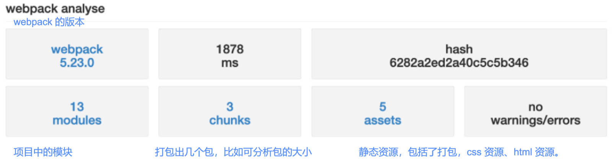

# TreeShaking & 文件压缩 & 打包分析 & 源码阅读

## 一、CSS tree shaking

CSS 也可以进行 Tree Shaking。需要借助插件；

> CSS 中的标签选择器，一般不做 tree shaking

在早期，使用 *PurifyCss* 插件（已不再维护），来完成 CSS 的 tree shaking；

目前使用 *PurgeCSS* 插件，可删除未使用的 CSS；

安装 PurgeCss 的 webpack 插件：

```shell
npm install purgecss-webpack-plugin -D
```

在生产环境的配置文件中，配置 *PurgeCss*。

- `paths`：表示要检测哪些目录下的内容；
  - 使用 Node 的 `glob`（如果没有该模块，安装一下）；
  - `{ nodir: true }`: 表示分析不是文件夹的内容。
- `safelist`：表示分析时排除某些标签。

Purgecss 也可以对 less 文件进行处理（所以，它是对打包后的 css 进行 tree shaking 操作）；

demo-project\14_webpack优化-TreeShaking\config\prod.config.js

```js
const { PurgeCSSPlugin } = require('purgecss-webpack-plugin')
const glob = require('glob')

module.exports = {
  plugins: [
    // 对CSS进行TreeShaking
    new PurgeCSSPlugin({
      paths: glob.sync(`${path.resolve(__dirname, '../src')}/**/*`, { nodir: true }),
      safelist: function() {
        return {
          standard: ["body"]
        }
      }
    })
  ]
}
```

## 二、Scope Hoisting

Scope Hoisting 是从 webpack 3 开始，增加的功能；

对 webpack 打包后的代码的作用域进行提升，使得代码体积更小、运行更快；

默认情况下，webpack 打包后的代码，会有很多的函数作用域.

- 比如最外层的 IIFE（Immediately Invoked Function Expression）：

Scope Hoisting 可将函数合并到一个模块中来运行；

webpack 已经内置了对应的模块：

- 在 production 模式下，默认这个模块就会启用；
- 在 development 模式下，需要自行配置打开；

:egg: 案例理解；

在配置文件中，进行配置：

demo-project\15_webpack优化-ScopeHoisting\config\prod.config.js

```js
module.exports = {
  plugins: [
    // 作用域提升
    new webpack.optimize.ModuleConcatenationPlugin()
  ]
}
```

如下代码结构，

demo-project\15_webpack优化-ScopeHoisting\src\demo\math.js

```js
export function sum(num1, num2) {
  return num1 + num2
}
//...
```

demo-project\15_webpack优化-ScopeHoisting\src\demo.js

```js
import { sum } from './demo/math'
//...
console.log(sum(20, 30))
```

可打包在同一作用域下：

demo-project\15_webpack优化-ScopeHoisting\build\js\main-bundle.js

```js
"use strict";(self.webpackChunkbabel_core_demo=self.webpackChunkbabel_core_demo||[]).push([[179],{"./src/demo.js":
/*!*********************************!*\
  !*** ./src/demo.js + 3 modules ***!
  \*********************************/function(){window.lyric="哈哈哈哈哈",console.log(function sum(o,e){return o+e}(20,30));console.log("Hello World"),function foo(o,e){console.log("foo function exec~"),console.log(o,e)}();var o=document.createElement("div");o.className="title",o.textContent="哈哈哈哈",document.body.append(o)}},function(o){var e;e="./src/demo.js",o(o.s=e)}]);
```

## 三、HTTP 压缩

HTTP 压缩，指的是：对 http 协议传输的内容，进行压缩；是一种内置在服务器、客户端之间，改进传输速度和带宽利用率的方式；

HTTP 压缩的流程：

1. 要压缩的静态资源，在服务器返回结果前，就已经被压缩了（在 webpack 中完成）；
2. 浏览器向服务器发送请求时，会告知服务器，支持哪些压缩格式；
3. 服务器返回对应格式的压缩文件，并且在响应头中告知浏览器；

常见的压缩格式。

- compress – UNIX 的“compress”程序的方法（历史性原因，不推荐使用，应该使用 gzip 或 deflate）；
- deflate – 基于 deflate 算法（定义于 RFC 1952）的压缩，使用 zlib 数据格式封装；
- gzip – GNU zip 格式（定义于 RFC 1952）的压缩，是目前使用比较广泛的压缩算法；
- br – 一种新的开源压缩算法，专为 HTTP 内容的编码而设计；

### 1.webpack 对文件压缩

webpack 可实现 HTTP 压缩的第一步操作，使用 `CompressionPlugin`。

1.安装 compression-webpack-plugin：

```shell
npm install compression-webpack-plugin -D
```

2.在配置文件中，进行配置：

```js
const CompressionPlugin = require("compression-webpack-plugin")

module.exports = {
  plugins: [
    // 对打包后的文件(js/css)进行压缩
    new CompressionPlugin({
      test: /\.(js|css)$/, // 匹配要压缩的文件
      algorithm: 'gzip',
      // minRatio: 0.7, // 至少的压缩比例
      // threshold: 300, // 设置文件从多大开始压缩。
      // include:
      // exclude:
    })
  ]
}
```

打包后的目录结构如下：

```txt
│-index.html
├─css
│   main.css
│   main.css.gz
└─js
    main-bundle.js
    main-bundle.js.gz
    runtime-bundle.js
    runtime-bundle.js.gz
```

## 四、HTML 文件压缩

以前使用过 `HtmlWebpackPlugin` 插件，来生成 HTML 的模板；

该插件还有一些其他的配置，如下：

- `inject`：设置打包的资源插入的位置
  - `true`、 `false `、`"body"`、`"head"`

- `cache`：默认值为 `true`，只有当文件改变时；才会生成新的文件；

- `minify`：默认会使用一个插件 *html-minifier-terser*

根据环境判断，进行配置：

```js
const getCommonConfig = function(isProdution) {
  return {
    plugins: [
      new HtmlWebpackPlugin({
        template: './index.html',
        cache: true,
        minify: isProdution? {
          removeComments: true,// 移除注释
          removeEmptyAttributes: true,// 移除空的属性
          removeRedundantAttributes: true,// 移除默认属性
          removeStyleLinkTypeAttributes: true, // 移除如 link 中的 type="text/css"
          useShortDoctype: true, // 如果模板是 html4，那么会转成 html5 的文档
          collapseWhitespace: true,// 折叠空白字符
          keepClosingSlash: true, // 保持氮元素尾部的 “/”
          minifyCSS: true,// 压缩内联的CSS
          // 压缩JavaScript
          minifyJS: {
            mangle: {
              toplevel: true
            }
          }
        }: false
      }),
    ]
  }
}
```

## 五、打包时间分析

如果希望看到每个 loader、每个 Plugin 在打包时消耗的时间，可借助于一个插件：*speed-measure-webpack-plugin*

1.安装 speed-measure-webpack-plugin 插件

```shell
npm install speed-measure-webpack-plugin -D
```

2.使用 speed-measure-webpack-plugin 插件

- 创建插件导出的对象 `SpeedMeasurePlugin`；
- 使用 `smp.wrap` 包裹导出的 webpack 配置；

demo-project\17_webpack优化-打包分析\config\comm.config.js

```js
const SpeedMeasurePlugin = require('speed-measure-webpack-plugin')

const smp = new SpeedMeasurePlugin()

//...

// webpack允许导出一个函数
module.exports = function(env) {
  const isProduction = env.production
  let mergeConfig = isProduction ? prodConfig: devConfig
  const finalConfig = merge(getCommonConfig(isProduction), mergeConfig)
  return smp.wrap(finalConfig)
}
```

## 六、打包文件分析

### 1.方案一

生成一个 `stats.json` 的文件。

配置 `package.json` 文件。

```json
{
  "scripts": {
    "build": "webpack --config ./config/comm.config.js --env production --profile --json=stats.json",
  },
}
```

执行命令，生成一个 `stats.json` 的文件。

```shell
npm run build
```

将该文件放到[该站点](http://webpack.github.com/analyse)，进行分析；

或下载[该项目](https://github.com/webpack/analyse)，运行，上传文件进行分析，分析结果如下图，可点击查看详情。



### 2.方案二

使用 *webpack-bundle-analyzer* 工具

1.安装该工具：

```shell
npm install webpack-bundle-analyzer -D
```

2.在 webpack 配置该插件：

demo-project\17_webpack优化-打包分析\config\prod.config.js

```js
const { BundleAnalyzerPlugin } = require('webpack-bundle-analyzer')

module.exports = {
  plugins: [
    // 对打包后的结果进行分析
    new BundleAnalyzerPlugin()
  ]
}
```

3.打包后，会在 `8888` 端口上提供服务，可以直接的看到每个包的大小。

- 比如有一个包是通过一个 Vue 组件打包的，但是非常的大，那么我们可以考虑是否可以拆分出多个组件，并且对其进行懒加载；
- 比如一个图片或者字体文件特别大，是否可以对其进行压缩或者其他的优化处理；

