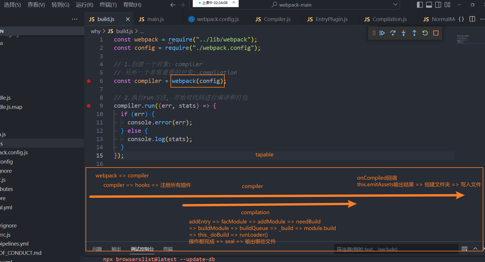

# webpack 源码

在 webpack 源码目录中，创建 zzt 文件夹，用于测试。

在 src 目录下，编写源码；创建 `build.js` 用于打包；

zzt\build.js

```js
const webpack = require("../lib/webpack");
const config = require("./webpack.config");

const compiler = webpack(config); // 看源码时，从这个入口开始看。

compiler.run((err, stats) => {
  if (err) {
    console.error(err);
  } else {
    console.log(stats);
  }
});
```

使用调试工具，进行源码阅读。

> 像 Vue / React 的脚手架，都是直接调用 `webpack` 函数，没有使用 webpack-cli
>
> 读源码，不是为了面试，而是学习思想；

webpack 源码非常优秀，但存在大量的回调地狱；

## 1.创建 Compiler

其中 hooks 的作用非常关键：

SyncHook、SyncBailHook...等等，源自于 *tapable* 库。

lib\Compiler.js G119

```js
class Compiler {
  /**
   * @param {string} context the compilation path
   * @param {WebpackOptions} options options
   */
  constructor(context, options = /** @type {WebpackOptions} */ ({})) {
    // 这个 hook 非常重要！
    this.hooks = Object.freeze({
      /** @type {SyncHook<[]>} */
      initialize: new SyncHook([]),

      /** @type {SyncBailHook<[Compilation], boolean>} */
      shouldEmit: new SyncBailHook(["compilation"]),
      /** @type {AsyncSeriesHook<[Stats]>} */
      done: new AsyncSeriesHook(["stats"]),
      /** @type {SyncHook<[Stats]>} */
      afterDone: new SyncHook(["stats"]),
//...
```

webpack 官方提供了一个库 *tapable*，安装该库，简单的使用；

```shell
npm install tapable -D
```

其中的核心代码如下：用于监听事件（后续会详细介绍）；

```js
import { AsyncSeriesHook } from 'tapable'

// 1.创建 hook
this.hook = {
  run: new AsyncSeriesHook(['compiler'])
}

// 2.监听事件
this.hooks.run.tabAsync('zzt', (res) => {})
this.hooks.run.tabAsync('abc', (res) => {})

// 3.使用 hook，触发事件
this.hooks.run.callAsync('abc', () => {
  // 执行下一个操作
})
```

## 2.注册 plugins

注册插件可传函数、对象。

对象中必须要有 `apply` 方法。

lib\webpack.js G61

```js
/**
 * @param {WebpackOptions} rawOptions options object
 * @returns {Compiler} a compiler
 */
const createCompiler = rawOptions => {
  const options = getNormalizedWebpackOptions(rawOptions);
  applyWebpackOptionsBaseDefaults(options);
  // 创建 compiler
  const compiler = new Compiler(options.context, options);
  new NodeEnvironmentPlugin({
    infrastructureLogging: options.infrastructureLogging
  }).apply(compiler);
  if (Array.isArray(options.plugins)) {
    for (const plugin of options.plugins) {
      if (typeof plugin === "function") {
        plugin.call(compiler, compiler);
      } else {
        plugin.apply(compiler);
      }
    }
  }
//...  
```

按照此规则，我们也可自行编写 plugin，如下：

```js
class ZTBeforeCompilerPlugin {
  apply(compiler) {
    compiler.hooks.beforeRun.tapAsync('aaa', (xxx) => {
      // 执行的回调函数
    })
  }
}
```

webpack 传入的选项，也会被转为插件。

lib\webpack.js G82

```js
/**
 * @param {WebpackOptions} rawOptions options object
 * @returns {Compiler} a compiler
 */
const createCompiler = rawOptions => {
  //...
  // 配置选项转插件。
  new WebpackOptionsApply().process(options, compiler);
  //...
};
```

## 3.打包生命周期

compiler 贯穿打包全流程；

创建 compiler 时，会创建 hooks，注册 plugin；

之后 compilation 会在编译模块时，创建出来；

再把结果交给 compiler；再由 compiler 将结果输出。



## 4.run 方法

调用 run 方法，开始执行编译工作。

lib\Compiler.js G517

```js
// 开始执行编译工作
const run = () => {
  this.hooks.beforeRun.callAsync(this, err => {
    if (err) return finalCallback(err);

    this.hooks.run.callAsync(this, err => {
      if (err) return finalCallback(err);

      this.readRecords(err => {
        if (err) return finalCallback(err);

        this.compile(onCompiled);
      });
    });
  });
};
```

## 5.创建 compilation

lib\Compiler.js G1175

```js
/**
 * @param {Callback<Compilation>} callback signals when the compilation finishes
 * @returns {void}
 */
compile(callback) {
  const params = this.newCompilationParams();
  // beforeRun => run => compile
  // beforeCompile => compile => make => finishMake => afterCompile => done => callback
  this.hooks.beforeCompile.callAsync(params, err => {
    if (err) return callback(err);

    this.hooks.compile.call(params);

    // 创建 compilation
    const compilation = this.newCompilation(params);
//...
```

## 6.make 方法

在调用 make 方法前：

lib\Compiler.js

```js
compile(callback) {
  cons··············································································t params = this.newCompilationParams();
  // beforeRun => run => compile
  // beforeCompile => compile => make => finishMake => afterCompile => done => callback
  this.hooks.beforeCompile.callAsync(params, err => {
    if (err) return callback(err);

    this.hooks.compile.call(params);

    // 创建 compilation
    const compilation = this.newCompilation(params);

    const logger = compilation.getLogger("webpack.Compiler");

    logger.time("make hook");
    // 真正开始编译
    this.hooks.make.callAsync(compilation, err => {
//...
```

注册 `EntryPlugin` 的时候，调用了 `apply` 方法。其中注册了 `EntryPlugin` 事件。

这里是 compilation 使用的地方，开始编译模块。

lib\EntryPlugin.js G50

```js
class EntryPlugin {
  /**
   * An entry plugin which will handle
   * creation of the EntryDependency
   *
   * @param {string} context context path
   * @param {string} entry entry path
   * @param {EntryOptions | string=} options entry options (passing a string is deprecated)
   */
  constructor(context, entry, options) {
    this.context = context;
    this.entry = entry;
    this.options = options || "";
  }

  /**
   * Apply the plugin
   * @param {Compiler} compiler the compiler instance
   * @returns {void}
   */
  apply(compiler) {
    compiler.hooks.compilation.tap(
      "EntryPlugin",
      (compilation, { normalModuleFactory }) => {
        compilation.dependencyFactories.set(
          EntryDependency,
          normalModuleFactory
        );
      }
    );

    const { entry, options, context } = this;
    const dep = EntryPlugin.createDependency(entry, options);

    // compilation 使用的地方
    compiler.hooks.make.tapAsync("EntryPlugin", (compilation, callback) => {
      // 开始对模块进行编译
      compilation.addEntry(context, dep, options, err => {
        callback(err);
      });
    });
  }
//...  
```

## 7.为入口创建模块

在 `_addEntryItem` 方法中，的 `this.addModuleTree` 方法中，将入口添加到模块中。

lib\Compilation.js

```js
_addEntryItem(context, entry, target, options, callback) {
  //...
  // 将入口添加到模块中。
  this.addModuleTree(
    {
      context,
      dependency: entry,
      contextInfo: entryData.options.layer
        ? { issuerLayer: entryData.options.layer }
        : undefined
    },
    (err, module) => {
      if (err) {
        this.hooks.failedEntry.call(entry, options, err);
        return callback(err);
      }
      this.hooks.succeedEntry.call(entry, options, module);
      return callback(null, module);
    }
  );
  //...
}
```

在 `this.handleModuleCreation` 方法中，处理入口模块。

lib\Compilation.js G2080

```js
// 处理入口模块
this.handleModuleCreation(
  {
    factory: moduleFactory,
    dependencies: [dependency],
    originModule: null,
    contextInfo,
    context
  },
  (err, result) => {
    if (err && this.bail) {
      callback(err);
      this.buildQueue.stop();
      this.rebuildQueue.stop();
      this.processDependenciesQueue.stop();
      this.factorizeQueue.stop();
    } else if (!err && result) {
      callback(null, result);
    } else {
      callback();
    }
  }
);
```

## 8.从入口分解模块

在 `this.factorizeModule` 中，因式分解；

对入口 `mian.js` 中，引入的模块，进行分解；

lib\Compilation.js G1771

```js
/**
 * @param {HandleModuleCreationOptions} options options object
 * @param {ModuleCallback} callback callback
 * @returns {void}
 */
handleModuleCreation(
  {
    factory,
    dependencies,
    originModule,
    contextInfo,
    context,
    recursive = true,
    connectOrigin = recursive
  },
  callback
) {
  const moduleGraph = this.moduleGraph;

  const currentProfile = this.profile ? new ModuleProfile() : undefined;

  // 因式分解，对入口 mian.js 中，引入的模块，进行分解；
  this.factorizeModule(
    {
      currentProfile,
      factory,
      dependencies,
      factoryResult: true,
      originModule,
      contextInfo,
      context
    },
    (err, factoryResult) => {
//...      
```

在 `this.buildModule` 开始构建模块

lib\Compilation.js G1928

```js
this.buildModule(module, err => {
  if (creatingModuleDuringBuildSet !== undefined) {
    creatingModuleDuringBuildSet.delete(module);
  }
  if (err) {
    if (!err.module) {
      err.module = module;
    }
    this.errors.push(err);

    return callback(err);
  }

  if (!recursive) {
    this.processModuleDependenciesNonRecursive(module);
    callback(null, module);
    return;
  }

  // This avoids deadlocks for circular dependencies
  if (this.processDependenciesQueue.isProcessing(module)) {
    return callback(null, module);
  }

  this.processModuleDependencies(module, err => {
    if (err) {
      return callback(err);
    }
    callback(null, module);
  });
});
```

## 9.将构建的模块加入队列

发现会将构建的模块，加入到队列中。

lib\Compilation.js G1339

```js
/**
 * Schedules a build of the module object
 *
 * @param {Module} module module to be built
 * @param {ModuleCallback} callback the callback
 * @returns {void}
 */
buildModule(module, callback) {
  this.buildQueue.add(module, callback);
}
```

队列的结构如下：

将要构建的模块，加入到队列中，会执行 `this._buildModule`。

lib\Compilation.js G948

```js
/** @type {AsyncQueue<Module, Module, Module>} */
this.buildQueue = new AsyncQueue({
  name: "build",
  parent: this.factorizeQueue,
  processor: this._buildModule.bind(this)
});
```

在 `module.needBuild` 方法中，判断哪些模块需要构建：

- 有些模块已经构建过，就不用构建了。

在 `module.build` 中构建模块，使用了多态。

lib\Compilation.js G1358

```js
/**
 * Builds the module object
 *
 * @param {Module} module module to be built
 * @param {ModuleCallback} callback the callback
 * @returns {void}
 */
_buildModule(module, callback) {
  const currentProfile = this.profile
    ? this.moduleGraph.getProfile(module)
    : undefined;
  if (currentProfile !== undefined) {
    currentProfile.markBuildingStart();
  }

  module.needBuild(
    {
      compilation: this,
      fileSystemInfo: this.fileSystemInfo,
      valueCacheVersions: this.valueCacheVersions
    },
    (err, needBuild) => {
      if (err) return callback(err);

      if (!needBuild) {
        if (currentProfile !== undefined) {
          currentProfile.markBuildingEnd();
        }
        this.hooks.stillValidModule.call(module);
        return callback();
      }

      this.hooks.buildModule.call(module);
      this.builtModules.add(module);
      module.build( // 在 module.build 中构建模块，使用了多态。
        this.options,
        this,
        this.resolverFactory.get("normal", module.resolveOptions),
        this.inputFileSystem,
        err => {
          if (currentProfile !== undefined) {
            currentProfile.markBuildingEnd();
          }
          if (err) {
            this.hooks.failedModule.call(module, err);
            return callback(err);
          }
          if (currentProfile !== undefined) {
            currentProfile.markStoringStart();
          }
          this._modulesCache.store(module.identifier(), null, module, err => {
            if (currentProfile !== undefined) {
              currentProfile.markStoringEnd();
            }
            if (err) {
              this.hooks.failedModule.call(module, err);
              return callback(new ModuleStoreError(module, err));
            }
            this.hooks.succeedModule.call(module);
            return callback();
          });
        }
      );
    }
  );
}
```

## 10.使用 loader 构建

在 `_doBuild` 方法中，拿到上下文的 loader，即 `loaderContext`；

在 `processResult` 方法中，处理构建后的结果。

lib\NormalModule.js G749

```js
_doBuild(options, compilation, resolver, fs, hooks, callback) {
  const loaderContext = this._createLoaderContext(
    resolver,
    options,
    compilation,
    fs,
    hooks
  );

  const processResult = (err, result) => {
//...
```

在 `runloader` 方法中，使用 loader 构建模块。

使用了单独的库 *loader-runner*。

lib\NormalModule.js

```js
const { getContext, runLoaders } = require("loader-runner");

runLoaders(
  {
    resource: this.resource,
    loaders: this.loaders,
    context: loaderContext,
    processResource: (loaderContext, resourcePath, callback) => {
      const resource = loaderContext.resource;
      const scheme = getScheme(resource);
      hooks.readResource
        .for(scheme)
        .callAsync(loaderContext, (err, result) => {
          if (err) return callback(err);
          if (typeof result !== "string" && !result) {
            return callback(new UnhandledSchemeError(scheme, resource));
          }
          return callback(null, result);
        });
    }
  },
  (err, result) => {
//...    
```

在 `processResult` 方法中，`return callback(error)`; 一个模块处理完成。

lib\NormalModule.js G771

```js
const processResult = (err, result) => {
  if (err) {
    if (!(err instanceof Error)) {
      err = new NonErrorEmittedError(err);
    }
    const currentLoader = this.getCurrentLoader(loaderContext);
    const error = new ModuleBuildError(err, {
      from:
        currentLoader &&
        compilation.runtimeTemplate.requestShortener.shorten(
          currentLoader.loader
        )
    });
    return callback(error);
  }
```

## 11.因式分解，处理另外模块

又来到 `this.factorizeModule` 因式分解方法中，处理依赖的另一个模块。

lib\Compilation.js G1771

```js
// 因式分解，对入口 mian.js 中，引入的模块，进行分解；
this.factorizeModule(
  {
    currentProfile,
    factory,
    dependencies,
    factoryResult: true,
    originModule,
    contextInfo,
    context
  },
  (err, factoryResult) => {
//...    
```

使用 `const newModule = factoryResult.module;` 创建一个新模块。

lib\Compilation.js G1806

```js
const newModule = factoryResult.module;
```

## 12.compilation 完成，来到 finishMake

compilation 完成后，来到 `this.hooks.finishMake` 中

lib\Compiler.js G1188

```js
// 真正开始进行编译
this.hooks.make.callAsync(compilation, err => {
  logger.timeEnd("make hook");
  if (err) return callback(err);

  // compilation 完成。
  logger.time("finish make hook");
  this.hooks.finishMake.callAsync(compilation, err => {
    logger.timeEnd("finish make hook");
    if (err) return callback(err);
```

## 13.封存构建的模块

其中 `compilation.seal` 方法，用于封存构建的模块，

将打包的模块保存到 chunk 中。

lib\Compilation.js G2800

```js
process.nextTick(() => {
  logger.time("finish compilation");
  compilation.finish(err => {
    logger.timeEnd("finish compilation");
    if (err) return callback(err);

    logger.time("seal compilation");
    // 封存构建的模块
    compilation.seal(err => {
      logger.timeEnd("seal compilation");
      if (err) return callback(err);
//...
```

## 14.回调 onCompiled

最后调用 `this.hooks.afterCompile` 中的 `callback`，回到 `onCompiled` 方法中；

lib\Compiler.js G451

```js
this.hooks.afterCompile.callAsync(compilation, err => {
  logger.timeEnd("afterCompile hook");
  if (err) return callback(err);

  return callback(null, compilation);
});
```

## 15.输出打包文件

使用 `this.emitAssets` 输出打包后的文件；

lib\Compiler.js 595

```js
// 等到 compilation 将所有的模块，编译完成后，会执行的函数。
const onCompiled = (err, compilation) => {
  if (err) return finalCallback(err);

  if (this.hooks.shouldEmit.call(compilation) === false) {
    compilation.startTime = startTime;
    compilation.endTime = Date.now();
    const stats = new Stats(compilation);
    this.hooks.done.callAsync(stats, err => {
      if (err) return finalCallback(err);
      return finalCallback(null, stats);
    });
    return;
  }

  process.nextTick(() => {
    logger = compilation.getLogger("webpack.Compiler");
    logger.time("emitAssets");
    this.emitAssets(compilation, err => {
      logger.timeEnd("emitAssets");
      if (err) return finalCallback(err);
//...
```
