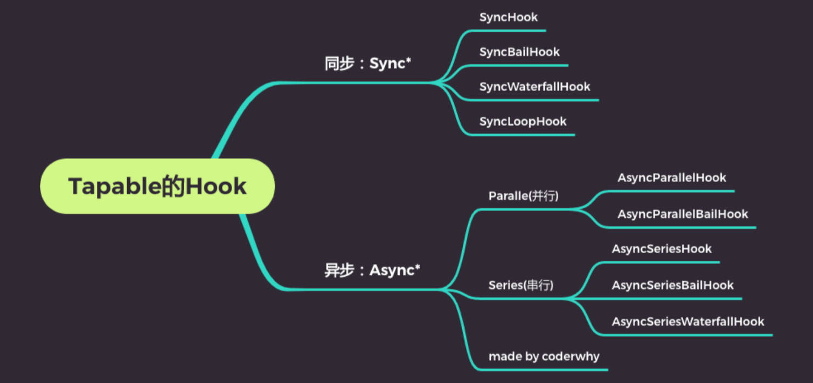

# 自定义 Loader & tapable 库

## 一、loader 是什么？

Loader 用于对模块的源代码，进行转换（处理）；

我们已用过很多 Loader，比如 *css-loader*、*style-loader*、*babel-loader* 等。

Loader 本质上是一个，**导出为函数的 JavaScript 模块**；

webpack 里，使用 *loader-runner* 库，调用这个函数，将上一个 loader 产生的结果，或者资源文件，传入进去；

### 1.编写一个 loader

编写一个 loader 模块，其中导出的函数，会接收三个参数：

- `content`：资源文件的内容；
- `map`：sourcemap 相关的数据；
- `meta`：一些元数据；

demo-project\18_webpack-自定义Loader\zt-loaders\zt_loader01.js

```js
module.exports = function(content, map, meta) {
  console.log("zt_loader01:", content)
  return content
}
```

在 `webpack.config.js` 中，直接使用该 loader，默认会去 node_modules 下查找，找不到，会报错，

- 要写成 `"./zt_loaders/zt_loader01.js"`；
- 或者，配置 `resolveLoader: { modules: ["node_modules", "/zt-loaders"] }`；

demo-project\18_webpack-自定义Loader\webpack.config.js

```js
const path = require('path')

module.exports = {
  mode: "development",
  entry: "./src/main.js",
  output: {
    path: path.resolve(__dirname, './build'),
    filename: "bundle.js"
  },
  resolveLoader: {
    modules: ["node_modules", "./zt-loaders"]
  },
  module: {
    rules: [
      {
        test: /\.js$/,
        use: [
          "zt_loader01",
        ]
      },
    ]
  }
}
```

> 【回顾】：`context` 配置的作用。

## 二、loader 执行顺序

多个 loader 的执行顺序，是“从后向前、从右向左”的。

### 1.pitch

可以给 loader 加 pitch 属性；

demo-project\18_webpack-自定义Loader\zt-loaders\zt_loader01.js

```js
/** 同步的 loader */
module.exports = function(content, map, meta) {
  console.log("zt_loader01:", content)
  return content
}

module.exports.pitch = function() {
  console.log("loader pitch 01")
}
```

demo-project\18_webpack-自定义Loader\zt-loaders\zt_loader02.js

```js
/** 同步的 loader */
module.exports = function(content) {
  console.log("zt_loader02:", content)
  return content + "bbbb"
}

module.exports.pitch = function() {
  console.log("loader pitch 02")
}
```

demo-project\18_webpack-自定义Loader\zt-loaders\zt_loader03.js

```js
/** 同步的 loader */
module.exports = function(content) {
  console.log("zt_loader03:", content)
  return content + "aaaa"
}

module.exports.pitch = function() {
  console.log("loader pitch 03")
}
```

demo-project\18_webpack-自定义Loader\webpack.config.js

```js
const path = require('path')

module.exports = {
  mode: "development",
  entry: "./src/main.js",
  output: {
    path: path.resolve(__dirname, './build'),
    filename: "bundle.js"
  },
  resolveLoader: {
    modules: ["node_modules", "./zt-loaders"]
  },
  module: {
    rules: [
      {
        test: /\.js$/,
        use: [
          "zt_loader01",
          "zt_loader02",
          "zt_loader03",
        ]
      },
    ]
  }
}
```

执行命令

```shell
pnpm run build
```

输出以下结果：

```shell
loader pitch 01
loader pitch 02
loader pitch 03
hy_loader03: const message = "Hello World"
console.log(message)


hy_loader02: const message = "Hello World"
console.log(message)

aaaa
zt_loader01: const message = "Hello World"
console.log(message)

aaaabbbb
```

由此可知，loader 模块上的 `pitch` 函数，会被自动执行；

它的执行顺序，与 normal loader 函数相反，是“正序”执行的。

### 2.执行顺序和 enforce

webpack 中的 loader-runner 库，

- 会优先执行 pitch loader，并进行 `loaderIndex++`；
- 之后执行 normal loader，并进行 `loaderIndex--`；

如果要改变它们的执行顺序，要在 `webpack.config.js` 文件中，进行配置；

拆分成多个 `rule` 对象，通过配置 `enforce`，来改变它们的顺序；

`enforce` 一共有四种方式：

- 默认所有的 loader 都是 `normal`；
- 在行内设置的 loader 是 `inline`（如：`import 'loader1!loader2!./test.js'`）；
- 也可以通过 `enforce` 设置 `pre` 和 `post`；

在 Pitching 和 Normal Loader 它们的执行顺序分别是：

- `post`, `inline`, `normal`, `pre`；
- `pre`, `normal`, `inline`, `post`；

demo-project\18_webpack-自定义Loader\webpack.config.js

```js
const path = require('path')

module.exports = {
  mode: "development",
  entry: "./src/main.js",
  output: {
    path: path.resolve(__dirname, './build'),
    filename: "bundle.js"
  },
  resolveLoader: {
    modules: ["node_modules", "./zt-loaders"]
  },
  module: {
    rules: [
      {
        test: /\.js$/,
        use: "zt_loader01"
      },
      {
        test: /\.js$/,
        use: "zt_loader02",
        enforce: "post" // 该 loader 中的 pitching，会被第一个执行；该 loader 本身，会在最后一个执行；
      },
      {
        test: /\.js$/,
        use: "zt_loader03"
      }
    ]
  }
}
```

## 三、同步的 loader

默认创建的 Loader，就是**同步的 Loader**；

这个 Loader，必须通过 `return` 或者 `this.callback` 来返回结果，交给下一个 loader 来处理；

通常，直接使用 `return` 即可；在有错误要处理的情况下，使用 `this.callback`，它的用法如下：

- 第一个参数，必须是 Error 或者 null；
- 第二个参数，是一个 string 或者 Buffer；

demo-project\18_webpack-自定义Loader\zt-loaders\zt_loader03.js

```js
/** 同步的 loader */
module.exports = function(content) {
  // this 绑定对象
  // 获取到同步的 allback
  const callback = this.callback

  // callback 进行调用:
  // 参数一: 错误信息
  // 参数二: 传递给下一个 loader 的内容
  callback(null, "哈哈哈哈")
}

module.exports.pitch = function() {
  console.log("loader pitch 03")
}
```

注意：同步的 loader 中，`callback` 不能在异步代码中使用；

## 四、异步的 loader

有时候，使用 Loader 时，会进行一些异步的操作；

我们希望，在异步操作完成后，再返回这个 loader 处理的结果；

这时，要使用异步的 Loader；

异步 loader 与同步 loader 的区别，在于 `this.async()` 调用，它返回的 `callback` 函数，可在异步代码中调用。

demo-project\18_webpack-自定义Loader\zt-loaders\zt_loader03.js

```js
module.exports = function(content) {
  const callback = this.async()

  // 进行异步操作
  setTimeout(() => {
    console.log("zt_loader03:", content)
    callback(null, content + "aaaa")
  }, 2000);
}
```

loader-runner 库，在执行 loader 时，已经提供了让 loader 变成一个异步的 loader 方法，

## 五、传入和获取参数

在使用 loader 时，传入参数。

在早期, 需要使用 *loader-utils* (webpack 开发的) 库，来获取参数：

```shell
npm install loader-utils -D
```

目前, 已经可以直接通过 `this.getOptions()` 直接获取到参数；

在 `webpack.config.js` 中，进行配置：

demo-project\18_webpack-自定义Loader\webpack.config.js

```js
const path = require('path')

module.exports = {
  mode: "development",
  entry: "./src/main.js",
  output: {
    path: path.resolve(__dirname, './build'),
    filename: "bundle.js"
  },
  resolveLoader: {
    modules: ["node_modules", "./zt-loaders"]
  },
  module: {
    rules: [
      {
        test: /\.js$/,
        use: [
          "zt_loader01",
          "zt_loader02",
          "zt_loader03",
          // 给 loader 传递参数
          {
            loader: "zt_loader04",
            options: {
              name: "wzt",
              age: 18
            }
          }
        ]
      },
    ]
  }
}
```

使用 `this.getOptions()` 获取传参。

demo-project\18_webpack-自定义Loader\zt-loaders\zt_loader04.js

```js
module.exports = function(content) {
  // 1.获取使用 loader 时, 传递进来的参数
  const options = this.getOptions()
  console.log(options)

  console.log('zt-loader04:', content)

  return content
}
```

### 1.检验参数

安装 webpack 官方提供的校验库 *schema-utils*；

```shell
npm install schema-utils -D
```

编写校验规则：

demo-project\18_webpack-自定义Loader\zt-loaders\schema\loader04_schema.json

```json
{
  "type": "object",
  "properties": {
    "name": {
      "type": "string",
      "description": "请输入名称, 并且是 string 类型"
    },
    "age": {
      "type": "number",
      "description": "请输入年龄, 并且是 number 类型"
    }
  }
}
```

在 loader 中，对参数进行验证：

demo-project\18_webpack-自定义Loader\zt-loaders\zt_loader04.js

```js
const { validate } = require('schema-utils')
const loader04Schema = require('./schema/loader04_schema.json')

module.exports = function(content) {
  const options = this.getOptions()
  console.log(options)

  // 2.校验参数是否符合规则，schema 是 json 格式的校验规则；
  validate(loader04Schema, options)

  console.log('zt-loader04:', content)

  return content
}
```

## 六、babel-loader 编写

安装 *@babel/core*

```shell
pnpm add @babel/core -D
```

编写 `zt-babel-loader.js`；

demo-project\19_webpack-自定义Loader-案例\zt-loaders\zt-babel-loader.js

```js
const babel = require('@babel/core')

module.exports = function(content) {
  // 1.使用异步 loader
  const callback = this.async()

  // 2.获取 options
  let options = this.getOptions()
  
  // 如果 webpack.config.js 文件中，没有 babel 相关的配置，那么从 babel.config.js 中读取。
  if (!Object.keys(options).length) {    
    options = require('../babel.config')
  }

  // 使用 Babel 转换代码
  babel.transform(content, options, (err, res) => {
    if (err) {
      callback(err)
    } else {
      callback(null, res.code)
    }
  })
}
```

配置 `webpack.config.js` 文件：

demo-project\19_webpack-自定义Loader-案例\webpack.config.js

```js
const path = require('path')
const HtmlWebpackPlugin = require('html-webpack-plugin')

module.exports = {
  mode: "development",
  devtool: false,
  entry: "./src/main.js",
  output: {
    path: path.resolve(__dirname, './build'),
    filename: "bundle.js"
  },
  resolveLoader: {
    modules: ["node_modules", "./zt-loaders"]
  },
  module: {
    rules: [
      {
        test: /\.jsx?$/,
        use: {
          loader: "zt-babel-loader",
          /* options: {
            plugins: [],
            presets: []
          } */
        }
      },
    ]
  },
  plugins: [
    new HtmlWebpackPlugin()
  ]
}
```

配置 `babel.config.js`，给 loader 传入参数：

demo-project\19_webpack-自定义Loader-案例\babel.config.js

```js
module.exports = {
  presets: [
    "@babel/preset-env"
  ]
}
```

## 七、md-loader 编写

安装 *marked* 库，用于转换 markdown 代码。

```shell
pnpm add marked -D
```

安装 *highlight.js* 库，为代码提供高亮；

```shell
pnpm add highlight.js -D
```

编写 `zt-md-loader.js`；

注意：loader 返回的结果，必须是模块化的内容。

demo-project\19_webpack-自定义Loader-案例\zt-loaders\zt-md-loader.js

```js
const { marked } = require('marked')
const hljs = require('highlight.js')

module.exports = function(content) {
  // 让 marked 库，解析语法的时候，将代码高亮内容标识出来
  marked.setOptions({
    highlight: function(code, lang) {
      return hljs.highlight(lang, code).value
    }
  })

  // 将 md 语法转化成 html 元素结构
  const htmlContent = marked(content)
  // console.log(htmlContent)

  // 返回的结果，必须是模块化的内容
  const innerContent = "`" + htmlContent + "`"
  const moduleContent = `var code = ${innerContent}; export default code;`

  return moduleContent
}
```

安装 *html-webpack-plugin* 插件：

```shell
pnpm add html-webpack-plugin -D
```

对样式进行优化，安装 *css-loader*、*style-loader*；

```shell
pnpm add css-loader style-loader -D
```

在 `webpack.config.js` 中，进行配置，

demo-project\19_webpack-自定义Loader-案例\webpack.config.js

```js
const path = require('path')
const HtmlWebpackPlugin = require('html-webpack-plugin')

module.exports = {
  mode: "development",
  devtool: false,
  entry: "./src/main.js",
  output: {
    path: path.resolve(__dirname, './build'),
    filename: "bundle.js"
  },
  resolveLoader: {
    modules: ["node_modules", "./zt-loaders"]
  },
  module: {
    rules: [
      {
        test: /\.jsx?$/,
        use: {
          loader: "zt-babel-loader"
        }
      },
      {
        test: /\.md$/,
        use: {
          loader: "zt-md-loader"
        }
      },
      {
        test: /\.css$/,
        use: [
          "style-loader",
          "css-loader"
        ]
      }
    ]
  },
  plugins: [
    new HtmlWebpackPlugin()
  ]
}
```

执行命令，打包：

```shell
pnpm run build
```

输出 `index.html` 文件，在其中展示 md 文本。

- 可自行编写样式；
- 也可使用 *highlight.js* 提供的默认 css 样式。

demo-project\19_webpack-自定义Loader-案例\src\main.js

```js
import code from "./md/learn.md" // md 转换后的 html 代码
import "highlight.js/styles/default.css" // 导入 highlight.js 的默认样式
import "./css/code.css" // 自己编写的样式

const message = "Hello World"
console.log(message)

const foo = () => {
  console.log("foo function exec~")
}
foo()

// 1.对 code 进行打印
console.log(code)

// 2.将它显示到页面中
document.body.innerHTML = code
```

## 八、webpack 和 tapable 库

webpack 有两个非常重要的类：`Compiler` 和 `Compilation`；

它们通过注入 Plugin 的方式，来监听 webpack 的所有生命周期；

Plugin 的注入，离不开各种各样的 Hook，而创建 Hook 实例，要用到 *tapable* 库；

所以，想要编写自定义插件，最好先了解 *tapable* 库；

*tapable* 是 webpack 官方编写和维护的一个库；

tapable 管理着需要的 Hook，这些 Hook 可以被应用到 webpack 的插件中；

## 九、tapable 有哪些 hook

主要分为同步和异步的 hook：

- 以“`sync`”开头的，是同步的 Hook；
- 以”`async`“开头的，是异步的 Hook；两个事件处理回调，不会等待上一次处理回调结束后再执行下一次回调；

其他的类别：

- `Bail`：当有返回值时（返回值不为 `undefined` 时），就不会执行后续的事件触发了；
- `Loop`：当返回值为 `true`，就会反复执行该事件；当返回值为 `undefined` 或者不返回内容，就退出事件；
- `Waterfall`：当返回值不为 `undefined` 时，会将这次返回的结果，作为下次事件的第一个参数；
- `Parallel`：并行，会同时处理 hook，再执行下一次事件处理回调；
- `Series`：串行，会等待上一个异步的 Hook，调用 `callback` 函数，再执行下一个 ；



### 1.SyncHook 使用

单独安装 tapable 库；

```shell
pnpm add tapable
```

使用时，一般分为三个步骤：

1. 创建 hook；
2. 用 hook 监听事件；
3. 用 hook 发送事件。

demo-project\20_webpack-tapable库使用\hooks\01_sync_基本使用.js

```js
const { SyncHook } = require('tapable')

class ZtCompiler {
  constructor() {
    this.hooks = {
      // 1.创建 hooks
      syncHook: new SyncHook(["name", "age"])
    }

    // 2.用 hooks 监听事件(自定义 plugin)
    this.hooks.syncHook.tap("event1", (name, age) => {
      console.log("event1 事件监听执行了:", name, age)
    })
    this.hooks.syncHook.tap("event2", (name, age) => {
      console.log("event2 事件监听执行了:", name, age)
    })
  }
}

const compiler = new ZtCompiler()

// 3.发出去事件
setTimeout(() => {
  compiler.hooks.syncHook.call("zzt", 18)
}, 2000);

// 执行结果：同时执行
// event1 事件监听执行了: zzt 18
// event2 事件监听执行了: zzt 18
```

### 2.SyncBailHook 使用

demo-project\20_webpack-tapable库使用\hooks\02_sync_Bail使用.js

```js
const { SyncBailHook } = require('tapable')

class ZtCompiler {
  constructor() {
    this.hooks = {
      // 1.创建 hooks
      // bail 的特点: 如果有返回值, 那么可以阻断后续事件继续执行
      bailHook: new SyncBailHook(["name", "age"])
    }


    // 2.用 hooks 监听事件(自定义 plugin)
    this.hooks.bailHook.tap("event1", (name, age) => {
      console.log("event1 事件监听执行了:", name, age)
      return 123
    })
    
    this.hooks.bailHook.tap("event2", (name, age) => {
      console.log("event2 事件监听执行了:", name, age)
    })
  }
}

const compiler = new ZtCompiler()

// 3.发出去事件
setTimeout(() => {
  compiler.hooks.bailHook.call("zzt", 18)
}, 2000);

// 返回结果
// event1事件监听执行了: zzt 18
```

### 3.SyncLoopHook 使用

demo-project\20_webpack-tapable库使用\hooks\03_sync_Loop使用.js

```js
const { SyncLoopHook } = require('tapable')

let count = 0

class ZtCompiler {
  constructor() {
    this.hooks = {
      // 1.创建 hooks
      loopHook: new SyncLoopHook(["name", "age"])
    }

    // 2.用 hooks 监听事件(自定义 plugin)
    this.hooks.loopHook.tap("event1", (name, age) => {
      if (count < 5) {
        console.log("event1 事件监听执行了:", name, age)
        count++
        return true
      }
    })
    
    this.hooks.loopHook.tap("event2", (name, age) => {
      console.log("event2 事件监听执行了:", name, age)
    })
  }
}

const compiler = new ZtCompiler()

// 3.发出去事件
setTimeout(() => {
  compiler.hooks.loopHook.call("zzt", 18)
}, 2000);

// 执行结果
// event1 事件监听执行了: zzt 18
// event1 事件监听执行了: zzt 18
// event1 事件监听执行了: zzt 18
// event1 事件监听执行了: zzt 18
// event1 事件监听执行了: zzt 18
// event2 事件监听执行了: zzt 18
```

### 4.SyncWaterfallHook 使用

demo-project\20_webpack-tapable库使用\hooks\04_sync_waterfall使用.js

```js
const { SyncWaterfallHook } = require('tapable')

class ZtCompiler {
  constructor() {
    this.hooks = {
      // 1.创建 hooks
      waterfallHook: new SyncWaterfallHook(['name', 'age'])
    }

    // 2.用 hooks 监听事件(自定义 plugin)
    this.hooks.waterfallHook.tap('event1', (name, age) => {
      console.log('event1 事件监听执行了:', name, age)

      return { xx: 'xx', yy: 'yy' }
    })

    this.hooks.waterfallHook.tap('event2', (name, age) => {
      console.log('event2 事件监听执行了:', name, age)
    })
  }
}

const compiler = new ZtCompiler()
// 3.发出去事件
setTimeout(() => {
  compiler.hooks.waterfallHook.call('zzt', 18)
}, 2000)

// 执行结果
// event1 事件监听执行了: zzt 18
// event2 事件监听执行了: { xx: 'xx', yy: 'yy' } 18
```

### 5.AsyncParallelHook 使用

parallel 并行 hook 的使用；

demo-project\20_webpack-tapable库使用\hooks\05_async_parallel使用.js

```js
const { AsyncParallelHook } = require('tapable')

class ZtCompiler {
  constructor() {
    this.hooks = {
      // 1.创建 hooks
      parallelHook: new AsyncParallelHook(["name", "age"])
    }

    // 2.用 hooks 监听事件(自定义 plugin)
    this.hooks.parallelHook.tapAsync("event1", (name, age) => {
      setTimeout(() => {
        console.log("event1 事件监听执行了:", name, age)
      }, 3000);
    })

    this.hooks.parallelHook.tapAsync("event2", (name, age) => {
      setTimeout(() => {
        console.log("event2 事件监听执行了:", name, age)
      }, 3000);
    })
  }
}

const compiler = new ZtCompiler()
// 3.发出去事件
setTimeout(() => {
  compiler.hooks.parallelHook.callAsync("zzt", 18)
}, 0);

// 执行结果，3s 后同时打印
// event1 事件监听执行了: zzt 18
// event2 事件监听执行了: zzt 18
```

### 6.AsyncSeriesHook 使用

serial 串行 hook 的使用；使用 callback

demo-project\20_webpack-tapable库使用\hooks\06_async_series使用.js

```js
const { AsyncSeriesHook } = require('tapable')

class ZtCompiler {
  constructor() {
    this.hooks = {
      // 1.创建 hooks
      seriesHook: new AsyncSeriesHook(["name", "age"])
    }

    // 2.用 hooks 监听事件(自定义 plugin)
    this.hooks.seriesHook.tapAsync("event1", (name, age, callback) => {
      setTimeout(() => {
        console.log("event1 事件监听执行了:", name, age)
        callback()
      }, 3000);
    })

    this.hooks.seriesHook.tapAsync("event2", (name, age, callback) => {
      setTimeout(() => {
        console.log("event2 事件监听执行了:", name, age)
        callback()
      }, 3000);
    })
  }
}

const compiler = new ZtCompiler()
// 3.发出去事件
setTimeout(() => {
  compiler.hooks.seriesHook.callAsync("zzt", 18, () => {
    console.log("所有任务都执行完成~")
  })
}, 0);

// 执行结果
// 3s 后打印：event1 事件监听执行了: zzt 18
// 再 3s 后打印：event2 事件监听执行了: zzt 18
// 所有任务都执行完成~
```

