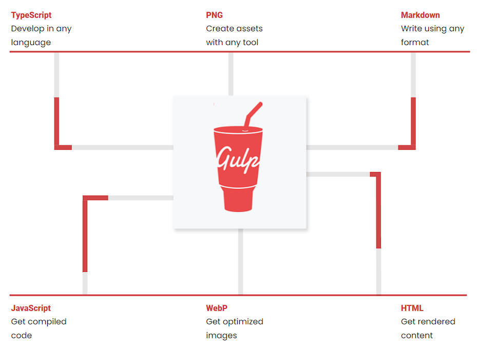

# 自定义 Plugin & Gulp 基本使用

## 一、Plugins 回顾

CleanWebpackPlugin

HTMLWebpackPlugin

MiniCSSExtractPlugin

CompressionPlugin

等等。。。

这些 Plugin，是如何注册到 webpack 的生命周期中的？

1. 在 `webpack` 函数的 `createCompiler` 方法中，注册了所有的插件；
2. 在注册插件时，会调用插件函数，或者插件对象的 `apply` 方法；
3. 它们会接收 `compiler` 对象，通过它，来注册 Hook 的事件；
4. 某些插件，也会传入一个 `compilation` 对象，也可通过它来注册 Hook 事件；

它们是如何注册到 webpack 生命周期中的？

lib\webpack.js G70

```js
//...
for (const plugin of options.plugins) {
  if (typeof plugin === "function") {
    plugin.call(compiler, compiler);
  } else {
    plugin.apply(compiler);
  }
}
```

## 二、自定义 Plugin

如何开发自己的插件呢？

大部分插件，都可以在社区中找到，推荐使用在维护，经过验证的插件；

现在，我们开发一个自己的插件，实现如下功能：

- 将静态资源打包完成后，自动上传到服务器；

自定义插件的过程：

1.创建 `AutoUploadWebpackPlugin` 类；

2.编写 `apply` 方法：

- 通过 ssh 连接服务器；
- 删除服务器原来的文件夹；
- 上传静态资源；

3.在 webpack 配置文件中，使用 `AutoUploadWebpackPlugin` 类；

> 【补充】：编写自定义插件，两种导出方式的不同：
>
> ```js
> module.exports = AutoUploadWebpackPlugin
> // 对应导入
> const AutoUploadWebpackPlugin = require('./plugin/autoUploadWebpackPlugin')
>
> module.exports.AutoUploadWebpackPlugin = AutoUploadWebpackPlugin
> // 对应导入
> const { AutoUploadWebpackPlugin } = require('./plugin/autoUploadWebpackPlugin')
> ```

### 1.基本结构

编写一个最简单的自定义 Plugin

```js
class AutoUploadWebpackPlugin {
  apply(compiler) {
    console.log('AutoUploadWebpackPlugin 被注册：', compiler)
  }
}

module.exports = AutoUploadWebpackPlugin
module.exports.AutoUploadWebpackPlugin = AutoUploadWebpackPlugin
```

### 2.AutoUploadWebpackPlugin

主要步骤：

1. 动态获取输出文件夹路径；
2. 使用 SSH 连接远程服务器，要用到一个库 *node-ssh*；
3. 将文件夹中资源上传到服务器中；
4. 销毁 ssh 连接；
5. 完成所有操作后，调用 `callback`。

编写自己的 plugin。为 plugin 传入参数。

> webpack [官方文档](https://webpack.docschina.org/api/plugins/)和源码中，都有 compiler 中的 hook 调用时机说明。
>
> webpack plugin 贯穿于整个打包的生命周期，每个阶段都有对应的 hook 被调用；
>
> 在 plugin 中，注册 hook，在不同的生命周期，进行相应的操作。

demo-project\21_webpack-自定义Plugin-案例\plugins\AutoUploadWebpackPlugin.js

```js
const { NodeSSH } = require('node-ssh')

class AutoUploadWebpackPlugin {
  constructor(options) {
    this.ssh = new NodeSSH()
    this.options = options
  }

  apply(compiler) {
    // 完成的事情: 注册 hooks 监听事件
    // 等到 assets 已经输出到 output 目录中（触发 afterEmit 事件时）, 完成自动上传的功能
    compiler.hooks.afterEmit.tapAsync("AutoPlugin", async (compilation, callback) => {
      // 1.获取输出文件夹路径(其中资源)
      const outputPath = compilation.outputOptions.path

      // 2.使用 SSH 连接远程服务器；
      await this.connectServer()

      // 3.删除原有的文件夹中内容；
      const remotePath = this.options.remotePath
      this.ssh.execCommand(`rm -rf ${remotePath}/*`)

      // 4.将文件夹中资源上传到服务器中
      await this.uploadFiles(outputPath, remotePath)

      // 5.关闭 ssh 连接
      this.ssh.dispose()

      // 完成所有的操作后, 调用callback()
      callback()
    })
  }

  async connectServer() {
    await this.ssh.connect({
      host: this.options.host,
      username: this.options.username,
      password: this.options.password
    })
    console.log('服务器连接成功')
  }

  async uploadFiles(localPath, remotePath) {
    const status = await this.ssh.putDirectory(localPath, remotePath, {
      recursive: true,
      concurrency: 10
    })
    if (status) {
      console.log("文件上传服务器成功~")
    }
  }
}

module.exports = AutoUploadWebpackPlugin
module.exports.AutoUploadWebpackPlugin = AutoUploadWebpackPlugin
```

> 服务器上，一般使用 nginx 进行了一些配置；

在 `webpac.config.js` 中，进行如下配置：

demo-project\21_webpack-自定义Plugin-案例\webpack.config.js

```js
const path = require('path')
const HtmlWebpackPlugin = require('html-webpack-plugin')

const AutoUploadWebpackPlugin = require('./plugins/AutoUploadWebpackPlugin')
const { PASSWORD } = require('./plugins/config')

module.exports = {
  entry: "./src/main.js",
  output: {
    path: path.resolve(__dirname, "./build"),
    filename: "bundle.js"
  },
  plugins: [
    new HtmlWebpackPlugin(),
    new AutoUploadWebpackPlugin({
      host: "123.207.32.32",
      username: "root",
      password: PASSWORD,
      remotePath: "/root/test"
    })
  ]
}
```

## 三、gulp 是什么？

官方定义：A toolkit to automate & enhance your workflow；

一个帮你增强工作流的自动化工具包；

学好 webpack，其它打包工具，都很简单；



## 四、gulp 和 webpack

gulp 的核心理念是：“task runner”

- 定义一系列任务，然后基于文件 Stream 的构建流；使用 gulp 的插件体系，来完成这些任务；

webpack 的核心理念是：“module bundler”

- webpack 是一个模块化的打包工具；
- 可以使用各种各样的 loader 来加载不同的模块；
- 可以使用各种各样的 plugin，在 webpack 打包的生命周期，完成其他的任务；

gulp 相对于 webpack 的优缺点：

- gulp 相对于 webpack，思想更加简单、易用，更适合编写一些自动化的任务；
- gulp 默认不支持模块化；
  - 目前大型项目（如 Vue、React、Angular），并不会使用 gulp 来构建；
  - 正在慢慢地退出历史舞台。

## 五、gulp 基本使用

安装 gulp：

```shell
# 全局安装
npm install gulp -g

# 局部安装
npm install gulp
```

编写 `gulpfile.js` 文件，在其中创建一个任务：

demo-project\22_gulp-gulp的基本使用\gulpfile.js

```js
// 编写简单的任务，如果不导出，那么是一个私有任务，不能被 node 执行。
const foo = (cb) => {
  console.log("第一个gulp任务")
  cb() // 执行 cb，表示任务结束。
}

// 编写异步的 gulp 任务
const bar = (cb) => {
  setTimeout(() => {
    console.log("bar任务被执行~")
    cb()
  }, 2000);
}

// 导出的任务
module.exports = {
  foo,
  bar
}
```

如下是 gulp 4 之前，创建任务的方式；现在也支持，但已经越来越少使用。

demo-project\22_gulp-gulp的基本使用\gulpfile.js

```js
const gulp = require('gulp')

// 早期编写任务的方式(gulp 4.x 之前)
gulp.task('foo', (cb) => {
  console.log("第二个gulp任务")
  cb()
})
```

执行 gulp 命令：

```shell
npx gulp foo
```

## 六、gulp 任务

每个 gulp 任务都是一个异步的 JavaScript 函数：

- 此函数接受一个 `callback` 作为参数，调用 `callback` 函数，那么任务会结束；
- 返回一个 stream、promise、event emitter、child process、observable 类型的函数，任务也会结束；

任务可以是 public、private 类型的：

- **公开任务（Public tasks）**从 `gulpfile.js` 中被导出，可以通过 gulp 命令直接调用；
- **私有任务（Private tasks）**被设计为在内部使用，通常作为 `series()` 或 `parallel()` 组合的组成部分；

### 1.默认任务

创建默认任务。

demo-project\22_gulp-gulp的基本使用\gulpfile.js

```js
// 默认任务
module.exports.default = (cb) => {
  console.log("default task exec~")
  cb()
}
```

执行默认任务：

```shell
npx gulp
```

### 2.任务组合

通常一个函数中，能完成的任务，是有限的；所有的任务逻辑，都放到一个函数中，也不方便代码的维护；

所以，一般会将任务进行组合。

gulp 提供了两个组合的方法：

- `series()`：串行任务组合；
- `parallel()`：并行任务组合；

demo-project\22_gulp-gulp的基本使用\gulpfile.js

```js
const { series, parallel } = require('gulp')

const foo1 = (cb) => {
  setTimeout(() => {
    console.log("foo1 task exec~")
    cb()
  }, 2000)
}

const foo2 = (cb) => {
  setTimeout(() => {
    console.log("foo2 task exec~")
    cb()
  }, 1000)
}

const foo3 = (cb) => {
  setTimeout(() => {
    console.log("foo3 task exec~")
    cb()
  }, 3000)
}

const seriesFoo = series(foo1, foo2, foo3)
const parallelFoo = parallel(foo1, foo2, foo3)

module.exports = {
  seriesFoo,
  parallelFoo
}
```

执行任务：

```shell
npx gulp seriesFoo

# 输出
[23:30:28] Starting 'seriesFoo'...
[23:30:28] Starting 'foo1'...
foo1 task exec~
[23:30:30] Finished 'foo1' after 2.01 s
[23:30:30] Starting 'foo2'...
foo2 task exec~
[23:30:31] Finished 'foo2' after 1.01 s
[23:30:31] Starting 'foo3'...
foo3 task exec~
[23:30:34] Finished 'foo3' after 3.01 s
[23:30:34] Finished 'seriesFoo' after 6.03 s

npx gulp parallelFoo

# 输出
[23:31:19] Starting 'parallelFoo'...
[23:31:19] Starting 'foo1'...
[23:31:19] Starting 'foo2'...
[23:31:19] Starting 'foo3'...
foo2 task exec~
[23:31:20] Finished 'foo2' after 1.01 s
foo1 task exec~
[23:31:21] Finished 'foo1' after 2 s
foo3 task exec~
[23:31:22] Finished 'foo3' after 3.01 s
[23:31:22] Finished 'parallelFoo' after 3.01 s
```

### 3.读取、写入文件

gulp 提供了 `src` 和 `dest` 方法，用于处理计算机上存放的文件。

`src` 方法，接受一个读取目录作为参数，并从文件系统中，读取文件然后生成一个 Node 中的流（Stream）。

- 它将所有匹配的文件，读取到内存中，并通过流（Stream）进行处理；

- 由 `src()` 产生的流（stream）应当从任务（task 函数）中，返回并发出异步完成的信号；

`dest` 方法，接受一个输出目录作为参数，并且它还会产生一个 Node 中的**可写流**。

- 通过该流，将内容输出到文件中；

在 Node 中，操作流（stream），提供的主要 API 是 `pipe` 方法。

`pipe` 方法，接受一个转换流（Transform streams）或可写流（Writable streams）；

转换流或者可写流，拿到数据之后，对数据进行处理，再次传递给下一个转换流或者可写流；

:egg: 案例理解：

将文件拷贝到指定路径：

demo-project\22_gulp-gulp的基本使用\gulpfile.js

```js
const { src, dest } = require('gulp')

const copyFile = () => {
  // 1.读取文件 2.写入文件
  // 如果 dist 文件夹不存在，会自动创建。
  // 返回一个 stream，任务结束。
  return src("./src/**/*.js").pipe(dest("./dist"))
}

module.exports = {
  copyFile
}
```

#### 1.glob 匹配规则

`src` 方法接受一个 glob 字符串，或由多个 glob 字符串组成的数组，作为参数；用于确定哪些文件需要被操作。

glob 或 glob 数组，必须至少匹配到一个匹配项，否则 `src()` 将报错；

glob 的匹配规则如下：

- “*”：表示在一个字符串中，匹配任意数量的字符，包括零个匹配；如 `"*.js"`
- “**”：表示在多个字符串匹配中，匹配任意数量的字符串，通常用在匹配目录下的文件；如 `"./src/**/*.js"`
- 取反!：
  - 由于 glob 匹配时，是按照每个 glob 在数组中的位置，依次进行匹配操作的；
  - 所以 glob 数组中的取反（negative）glob 必须跟在一个非取反（non-negative）的 glob 后面；
  - 第一个 glob 匹配到一组匹配项，然后后面的取反 glob 删除这些匹配项中的一部分；
  - 比如：`['script/**/*.js', '!script/vendor/']`

### 4.插件使用

在任务中，使用 gulp 生态中，babel，terser 相关插件；

gulp 插件的使用，更多插件见[官方文档](https://gulpjs.com/plugins)；

安装 *gulp-babel* 插件。它本身依赖 babel，要安装 *@babel/core*

```shell
pnpm add @babel/core gulp-babel -D
```

安装 babel 预设。

```shell
pnpm add @babel/preset-env
```

编写任务：

demo-project\22_gulp-gulp的基本使用\gulpfile.js

```js
const { src, dest } = require('gulp')
const babel = require('gulp-babel')

const jsTask = () => {
  return src("./src/**/*.js")
    // .pipe(babel({presets: ["@babel/preset-env"]})) // 或者可以把 preset 相关配置，放到 babel.config.js 中。
    .pipe(babel())
    .pipe(dest("./dist"))
}

module.exports = {
  jsTask
}
```

demo-project\22_gulp-gulp的基本使用\babel.config.js

```js
module.exports = {
  presets: ["@babel/preset-env"]
}
```

安装 *gulp-terser* 插件。

```shell
pnpm add gulp-terser -D
```

在任务中，使用 terser

demo-project\22_gulp-gulp的基本使用\gulpfile.js

```js
const { src, dest } = require('gulp')
const babel = require('gulp-babel')
const terser = require('gulp-terser')

const jsTask = () => {
  return src("./src/**/*.js")
    .pipe(babel())
    .pipe(terser({ mangle: { toplevel: true } }))
    .pipe(dest("./dist"))
}

module.exports = {
  jsTask
}
```

执行命令：

```shell
npx gulp jsTask
```
